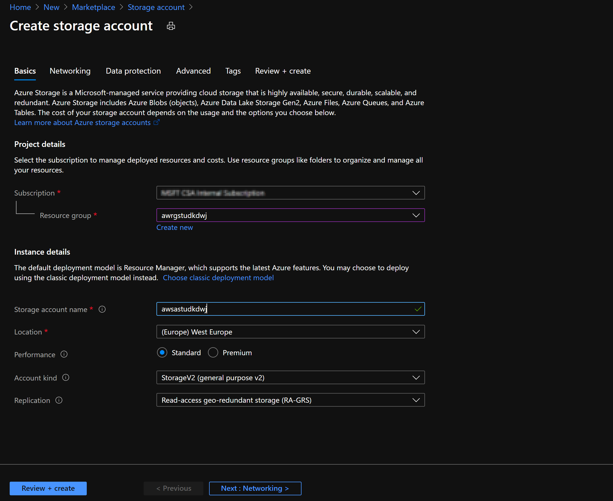
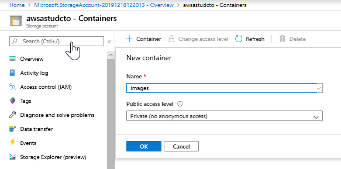
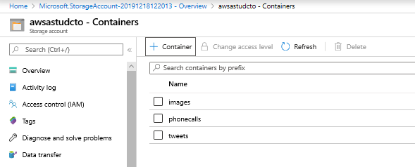
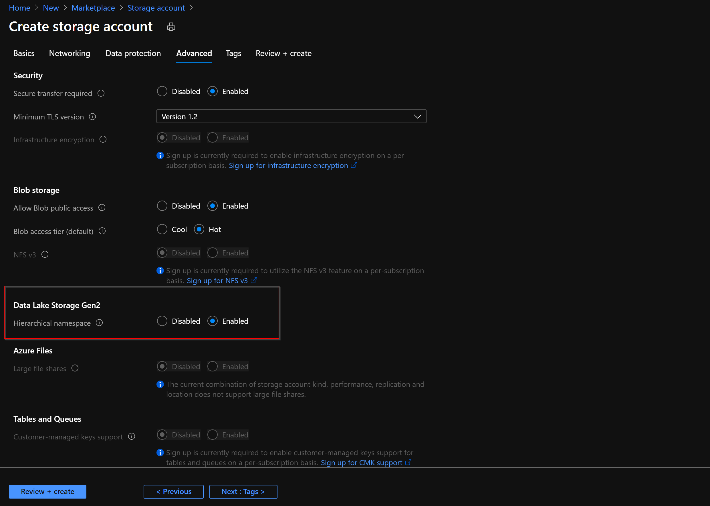
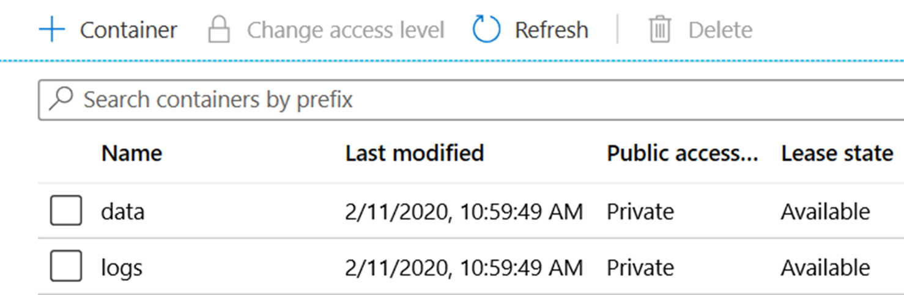
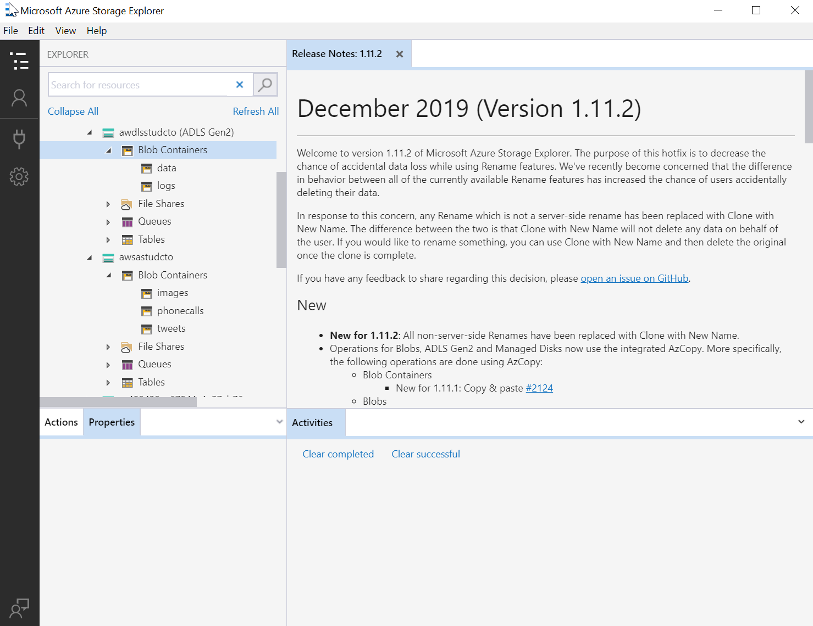
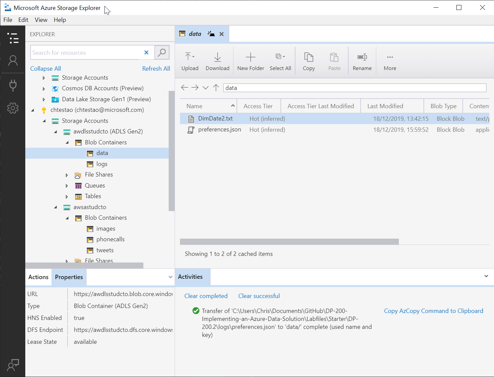

# Lab Working with Data Storage

## Lab overview

Students will be able to create Azure storage accounts and Data Lake Storage accounts and explain the difference between a storage account and and a data lake. They will also be able to demonstrate how to perform data loads into the data storage of choice.

## Exercise 2: Create an Azure Storage Account  

1. Browse to the Azure portal at [**http://portal.azure.com**](http://portal.azure.com) and sign in.

1. In the Azure portal, at the top left of the screen, click on the **Home** hyperlink

2. In the Azure portal, click on the **+ Create a resource** icon.

3. In the New screen, click **Storage account** in the list that appears.

4. In the **Storage account** screen, click **Create**.

5. From the **Create a storage account** screen in the **Basics** tab, create the first storage account with the following settings:

    - Under the project details, specify the following settings:

        - **Subscription**: select your subscription.
    
        - **Resource group**: click new, and type **ADF**.

    - Under the Instance details, specify the following settings:
    
        - **Storage account name**: Choose a unique name for your storage account. Storage account names must be between 3 and 24 characters in length and may contain numbers and lowercase letters only. Please keep in mind this is (part of) a FQDN. So the name needs to be globally unique.

        - **Region**: **West Europe**.

        - **Performance**: **Standard**. This type of account is recommended by Microsoft for most scenarios. Please keep in mind that Premium performance only allows you to select Locally Redundant Storage.

    1. Select the advanced tab.

        - **Redundancy**: **Geo-redundant storage (GRS)**

        - Select **Make read access to data available in the event of regional unavailability.**

            

6. In the **Create storage account** screen, click **Review + create**.

7. After the validation of the **Create storage account*** screen, click **Create**.

   > **Note**: The creation of the storage account will take approximately 90 seconds while it provisions the disks and the configuration of the disks as per the settings you have defined.

### Task 3: Create and configure a container within the storage account.

1. In the Azure portal, a message states that _Deployment succeeded_, click on the button **Go to resource**.

2. In the **awsastudxx** screen, where **xx** are your initials, under the **Data storage** click **Containers**.

3. In the **awsastudxx - Containers** screen, at the top left, click on the  **+ Container** button.

4. From the **New Container*** screen, create a container with the following settings:

    - Name: **images**.

    - Public access level: **Private (no anonymous access)**

        

5. In the **New Container** screen, click **Create**.

   > **Note**: The creation of the container is immediate and will appear in the list of the **awrgstudxx - Containers** screen.

6. Repeat steps 4 -5 to create a container named **phonecalls** with the public access level of **Private (no anonymous access)**

7. Repeat steps 4 -5 to create a container named **tweets** with the public access level of **Private (no anonymous access)**. Your screen should look as the graphic below:

    

### Task 4: Upload some graphics to the images container of the storage account.

1. In the Azure portal, in the **awsastudxx - Containers** screen, click on the **images** container in the list.

2. In the **images** screen, click on the **Upload** button.

3. In the **Upload blob** screen, in the Files text box, click on the **folder** icon to the right of the text box.

4. In the **Open** dialog box, browse to  **Labfiles\Starter\DP-200.2\website graphics** folder. Highlight the following files:

    - one.png

    - two.png

    - three.png

    - No.png

5. In the **Open** dialog box, click **Open**. 

6. In the **Upload blob** screen, click on the **Upload** button.

7. Close the **Upload blob** screen, and close the **images** screen.

8. Close the **awsastudxx - Containers** screen, and in the Azure portal, navigate to the **Home** screen. 

   > **Note**: The upload of the files will take approximately 5 seconds. Once completed, they will appear in a list in the upload blobs screen.

> **Result**: After you completed this exercise, you have created a Storage account named awsastudxx that has a container named images that contains four graphics files that are ready to be used on the AdventureWorks website.

## Exercise 3: Explain Azure Data Lake Storage
  
Estimated Time: 15 minutes

Individual exercise
  
The main tasks for this exercise are as follows:

1. Create and configure a storage account named **awdlsstudxx** as a Data Lake Store Gen2 storage type in the region closest to the lab location, within the resource group awrgstudxx, where **xx** are your initials.

2. Create containers named **logs** and **data** within the awdlsstudxx storage account.

### Task 1: Create and configure a storage account as a Data Lake Store Gen II store.

1. In the Azure portal, click on **+ Create a resource** icon.

2. In the New screen, click in the **Search services and marketplace** text box, and type the word **storage**. Click **Storage account** in the list that appears.

3. In the **Storage account** blade, click **Create**.

4. From the **Create a storage account*** blade, create a storage account with the following settings:

    - Under the project details, specify the following settings:

        - **Subscription**: the name of the subscription you are using in this lab
    
        - **Resource group name**: **awrgstudxx**, where **xx** are your initials.

    - Under the instance details, specify the following settings:

        - **Storage account name**: **awdlsstudxx**, where **xx** are your initials.

        - **Region**: the name of the Azure region which is closest to the lab location and where you can provision Azure VMs.

        - **Performance**: **Standard**.

        - **Redundancy**: **Geo-redundant storage (GRS)**

         - Select **Make read access to data available in the event of regional unavailability.**       

5. Click on the **Advanced** tab.

6. Under Data Lake Storage Gen2, check the checkbox for **Enable hierarchical namespace**.

    

7. In the **Create a storage account** blade, click **Review + create**.

8. After the validation of the  **Create storage account*** blade, click **Create**.

   > **Note**: The creation of the storage account will take approximately 90 seconds while it provisions the disks and the configuration of the disks as per the settings you have defined.

### Task 2: Create and configure a Container within the storage account.

1. In the Azure portal, a message states that _Deployment succeeded_, click on the button **Go to resource**.

2. In the **awdlsstudxx** screen, where **xx** are your initials, click **Containers**.

3. In the **awrgstudxx - Containers** screen, at the top left, click on the  **+ Containers** button.

4. From the **New** screen, create two containers with the following name:

    - Name: **data** with the public access level of **Private (no anonymous access)**.

    - Name: **logs** with the public access level of **Private (no anonymous access)**.

5. In the **New Container** screen, click **Create**.

   > **Note**: The creation of the file system is immediate and will appear in the list of the **awdlsstudxx - Containers** screen as follows.

    

> **Result**: After you completed this exercise, you have created a Data Lake Gen2 Storage account named awdlsstudxx that has a file system named data and logs.

## Exercise 4: Upload data into Azure Data Lake.
  

### Task 1: Install Storage Explorer.

1. In the Azure portal, in the **awdlsstudxx** overview page, navigate to **Storage Explorer (preview)** and then navigate to **Containers**

2. Click on the **logs** container and click on **Upload**

3. On the right hand side a popup will appear and click on the **Download Azure Storage Explorer** hyperlink.

4. You are taken to the following web page for [Azure Storage Explorer](https://azure.microsoft.com/en-us/features/storage-explorer/) where there is a button that states **Download now**. click on this button.

5. In the Microsoft Edge dialog box click **Save**, when the download is complete, click on **View downloads**, in the download screen in Microsoft Edge, click on **Open folder**. This will open the Downloads folder.

6. Double click the file **StorageExplorer.exe**, in the User Account Control dialog box click on **Yes**.

7. In the License Agreement screen, select the radio button next to **I agree the agreement**, and then click on **Install**.

   > **Note**: The installation of Storage Explorer can take approximately 4 minutes. Azure Storage Explorer allows you to easily manage the contents of your storage account with Azure Storage Explorer. Upload, download, and manage blobs, files, queues, tables, and Cosmos DB entities. It also enables you to gain easy access to manage your virtual machine disks.

8. On completion of the installation, ensure that the checkbox next to **Launch Microsoft Azure Storage Explorer** is selected and then click **Finish**. Microsoft Azure Storage Explorer opens up and lists your subscriptions.

9. In Storage Explorer, select **Manage Accounts** to go to the **Account Management Panel**.

10. The left pane now displays all the Azure accounts you've signed in to. To connect to another account, select **Add an account**

11. Select **Subscription**

12. Select the Azure environment you will use to sign in

13. You will be redirect to a login page

14. Select your account where the following pop up message should show up **Authenticated. You can return to Storage Explorer. You might need to authenticate again if you close this browser tab**

15. After you successfully sign in with an Azure account, the account and the Azure subscriptions associated with that account are added to the left pane. Select the Azure subscriptions that you want to work with, and then select **Open explorer**. The left pane displays the storage accounts associated with the selected Azure subscriptions.

    

### Task 2: Upload data files to the data and logs container of the Data Lake Gen II Storage Account.

1. In Azure Storage Explorer, click on the arrow to expand your subscription.

2. Under **Storage Accounts**, search for the storage account **awdlsstudxx (ADLS Gen2)**, and click on the arrow to expand it.

3. Under **Blob Containers**, click on the arrow to expand it and show the **logs** file system. Click on the **logs** file system.

4. In Azure Storage Explorer, click on the arrow of the **Upload** icon, and click on the **Upload Files..**.

5. In Upload Files dialog box, click on the ellipsis next to the **Selected files** text box.

6. In the **Choose files to upload** dialog box, browse to **Labfiles\Starter\DP-200.2\logs** folder. Highlight the following files:

    - weblogsQ1.log

    - weblogsQ2.log

    - preferences.json

7. In the **Choose files to upload** dialog box, click **Open**.

8. In the **Upload Files** screen, click on the **Upload** button.

   

9. Under **Blob Containers**, click on the arrow to expand it and show the **data** file system. Click on the **data** file system.

10. In Azure Storage Explorer, click on the arrow of the **Upload** icon, and click on the **Upload Files..**.

11. In Upload Files dialog box, click on the ellipsis next to the **Selected files** text box.

12. In the **Choose files to upload** dialog box, browse to **Labfiles\Starter\DP-200.2\Static Files** folder. Highlight the following files:

    - DimDate2.txt

13. In the **Choose files to upload** dialog box, click **Open**.

14. In the **Upload Files** screen, click on the **Upload** button.

15. Repeat the steps to upload the preferences.JSON file from the **Labfiles\Starter\DP-200.2\logs** folder to the **data** file system in the Data Lake Store gen2

   > **Note**: The upload of the files will take approximately 5 seconds. You will see a message in Azure Storage Explorer that states **Your view may be out of data. Do you want to refresh? Click Yes**. Once completed, all two files will appear in a list in the upload blobs screen.

   

16. In Azure Storage Explorer, in the data file system, click on the **+ New Folder** button.

17. In the New Folder screen, in the New folder name text box, type **output** and click on **OK**

18. Close down Azure Storage Explorer.

19. Return to the Azure portal, and navigate to the **Home** blade.

> **Result**: After you completed this exercise, you have created a Data Lake Gen II Storage account named awdlsstudxx that has a file system named data that contains two weblog files that are ready to be used by the Data scientists at AdventureWorks.

