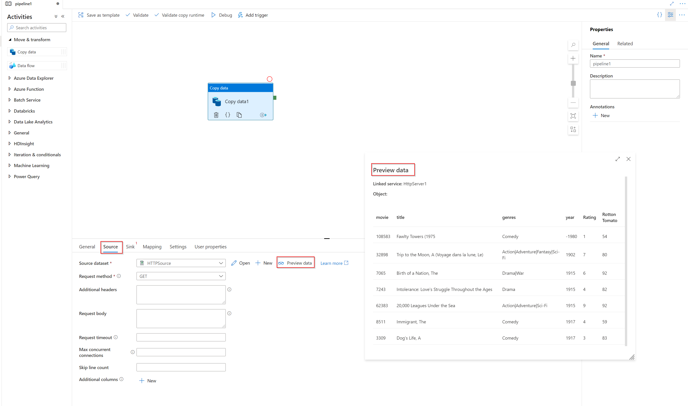
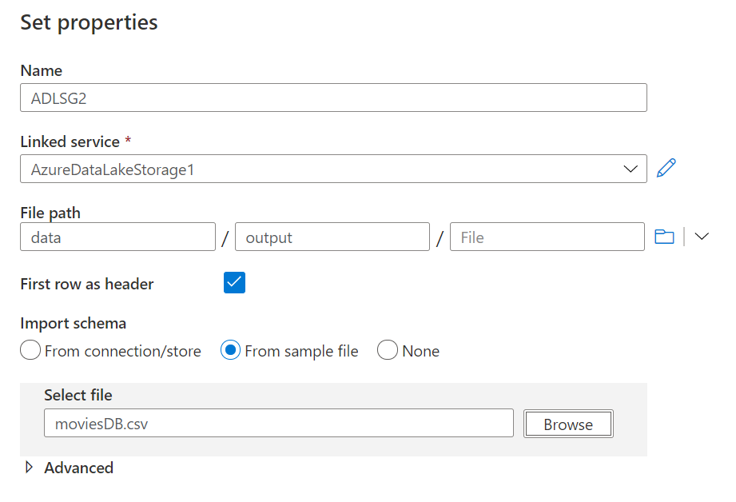

# Lab - Orchestrating Data Movement with Azure Data Factory

**Estimated Time**: 70 minutes

**Pre-requisites**: It is assumed that the case study for this lab has already been read. It is assumed that the content and lab for module 1: Azure for the Data Engineer has also been completed

* **Azure subscription**: If you don't have an Azure subscription, create
    a [free account](https://azure.microsoft.com/free/) before you begin.

* **Azure Data Lake Storage Gen2 storage account**: If you don't have an ADLS
    Gen2 storage account, see the instructions in [Create an ADLS Gen2 storage
    account](https://docs.microsoft.com/en-us/azure/storage/blobs/data-lake-storage-quickstart-create-account).

* **Azure Synapse Analytics**: If you don't have a Azure Synapse Analytics account, see the instructions in [Create a SQL DW
    account](https://docs.microsoft.com/en-us/azure/sql-data-warehouse/create-data-warehouse-portal).

**Lab files**: The files for this lab are located in the _Allfiles\Labfiles\Starter\DP-200.7_ folder.

## Lab overview

In this module, students will learn how Azure Data factory can be used to orchestrate the data movement from a wide range of data platform technologies. They will be able to explain the capabilities of the technology and be able to set up an end to end data pipeline that ingests data from SQL Database and load the data into Azure Synapse Analytics. The student will also demonstrate how to call a compute resource.

## Lab objectives
  
After completing this lab, you will be able to:

1. Setup Azure Data Factory
2. Ingest data using the Copy Activity
3. Use the Mapping Data Flow task to perform transformation
4. Perform transformations using a compute resource

## Scenario
  
You are assessing the tooling that can help with the extraction, load and transforming of data into the data warehouse, and have asked a Data Engineer within your team to show a proof of concept of Azure Data Factory to explore the transformation capabilities of the product. The proof of concept does not have to be related to AdventureWorks data, and you have given them freedom to pick a dataset of their choice to showcase the capabilities.

In addition, the Data Scientists have asked to confirm if Azure Databricks can be called from Azure Data Factory. To that end, you will create a simple proof of concept Data Factory pipeline that calls Azure Databricks as a compute resource.

At the end of this lad, you will have:

1. Setup Azure Data Factory
2. Ingested data using the Copy Activity
3. Used the Mapping Data Flow task to perform transformation
4. Performed transformations using a compute resource

> **IMPORTANT**: As you go through this lab, make a note of any issue(s) that you have encountered in any provisioning or configuration tasks and log it in the table in the document located at _\Labfiles\DP-200-Issues-Doc.docx_. Document the Lab number, note the technology, Describe the issue, and what was the resolution. Save this document as you will refer back to it in a later module. When you're not using the dedicated SQL Pool, please pause. If you do use the dedicated SQL pool, resume. 

## Exercise 1: Setup Azure Data Factory

Estimated Time: 15 minutes

Individual exercise

The main task for this exercise are as follows:

1. Setup Azure Data Factory

### Task 1: Setting up Azure Data Factory.

Create your data factory: Use the [Azure Portal](https://portal.azure.com) to create your Data Factory. 

1. In Microsoft Edge, go to the Azure portal tab, click on the **+ Create a resource** icon, type **data factory**, and then click **Data Factory** from the resulting search, and then click **Create**.

2. In the New Data Factory screen, create a new Data Factory with the following options:
    - **Subscription**: Your subscription
    - **Resource group**: awrgstudxx
    - **Region**: select the location closest to you    
    - **Name**: xx-data-factory, where xx are your initials
    - **Version**: V2
    - Leave other options to their default settings

        

    > **Note**: The creation of the Data Factory takes approximately 1 minute.

3. In the **git configuration** blade **check** Configure git later. 

4. Click **review + create** and then select **create**.

> **Result**: After you completed this exercise, you have created an instance of Azure Data Factory

## Exercise 2: Ingest data using the Copy Activity
  
Estimated Time: 15 minutes

Individual exercise
  
The main tasks for this exercise are as follows:

1. Add the Copy Activity to the designer

2. Create a new HTTP dataset to use as a source

3. Create a new ADLS Gen2 sink

4. Test the Copy Activity

### Task 1: Add the Copy Activity to the designer

1. On the deployment successful message, click on the button **Go to resource**.

2. In the xx-data-factory screen, in the middle of the screen, click on the button, **Author & Monitor**

3. **Open the authoring canvas** If coming from the ADF homepage, click on the **pencil icon** on the left sidebar and select the **+ pipeline button** to open the authoring canvas and create a pipeline.

4. **Add a copy activity** In the Activities pane, open the **Move and Transform** accordion and drag the **Copy data** activity onto the pipeline canvas.

    

### Task 2: Create a new HTTP dataset to use as a source

1. In the Source tab of the Copy activity settings, click **+ New**

2. In the data store list, select the **HTTP** tile and click **continue**

3. In the file format list, select the **DelimitedText** format tile and click **continue**

4. In **Set properties** blade, give your dataset an understandable name such as **HTTPSource** and click on the **Linked Service** dropdown. If you have not created your HTTP Linked Service, select **New**.

5. In the **New Linked Service (HTTP)** screen, copy the URL of the moviesDB csv file below in the **Base URL** textbox.  You can access the data with no authentication required using the following endpoint:

    https://raw.githubusercontent.com/djpmsft/adf-ready-demo/master/moviesDB.csv

6. In the **Authentication type** drop down, select **Anonymous**. and click on **Create**.

    -  Once you have created and selected the linked service, specify the rest of your dataset settings. These settings specify how and where in your connection we want to pull the data. As the url is pointed at the file already, no relative endpoint is required. As the data has a header in the first row, set **First row as header** to be true and select Import schema from **connection/store** to pull the schema from the file itself. Select **Get** as the request method. You will see the following screen

        
           
    - Click **OK** once completed.
   
    a. To verify your dataset is configured correctly, click **Preview data** in the Source tab of the copy activity to get a small snapshot of your data.
   
   

### Task 3: Create a new ADLS Gen2 dataset sink

1. Click on the **Sink tab**, and the click **+ New**

2. Select the **Azure Data Lake Storage Gen2** tile and click **Continue**.

3. Select the **DelimitedText** format tile and click **Continue**.

4. In Set Properties blade, give your dataset an understandable name such as **ADLSG2** and click on the **Linked Service** dropdown. If you have not created your ADLS Linked Service, select **New**.

5. In the New linked service (Azure Data Lake Storage Gen2) blade, select your authentication method as **Account key**, select your **Azure Subscription** and select your Storage account name of **awdlsstudxx**. You will see a screen as follows:

   

6. Click on **Create**

7. Once you have configured your linked service, you enter the set properties blade. As you are writing to this dataset, you want to point the folder where you want moviesDB.csv copied to. In the example below, I am writing to folder **output** in the file system **data**. While the folder can be dynamically created, the file system must exist prior to writing to it. Set **First row as header** to be true. You can either Import schema from **sample file** (use the moviesDB.csv file from **Labfiles\Starter\DP-200.7\SampleFiles**)  

   

8. Click **OK** once completed.

### Task 4: Test the Copy Activity

At this point, you have fully configured your copy activity. To test it out, click on the **Debug** button at the top of the pipeline canvas. This will start a pipeline debug run.

1. To monitor the progress of a pipeline debug run, click on the **Output** tab of the pipeline

2. To view a more detailed description of the activity output, click on the eyeglasses icon. This will open up the copy monitoring screen which provides useful metrics such as Data read/written, throughput and in-depth duration statistics.

   

3. To verify the copy worked as expected, open up your ADLS gen2 storage account and check to see your file was written as expected

