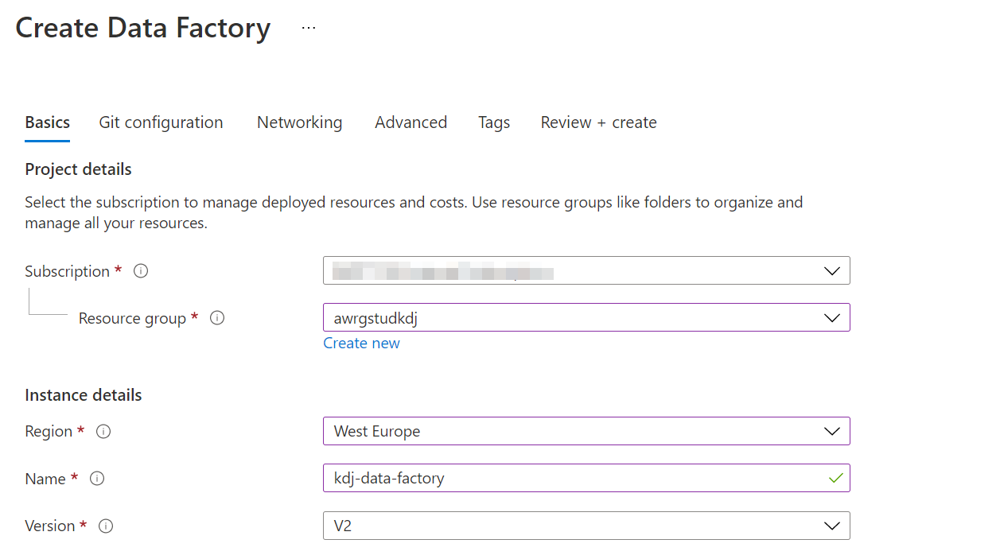

# Lab - Orchestrating Data Movement with Azure Data Factory

## Lab overview

In this module, students will learn how Azure Data factory can be used to orchestrate the data movement from a wide range of data platform technologies. They will be able to explain the capabilities of the technology and be able to set up an end to end data pipeline that ingests data from SQL Database and load the data into Azure Synapse Analytics. The student will also demonstrate how to call a compute resource.

## Lab objectives
  
After completing this lab, you will be able to:

1. Setup Azure Data Factory
2. Ingest data using the Copy Activity
3. Use the Mapping Data Flow task to perform transformation
4. Perform transformations using a compute resource

## Scenario
  
You are assessing the tooling that can help with the extraction, load and transforming of data into the data warehouse, and have asked a Data Engineer within your team to show a proof of concept of Azure Data Factory to explore the transformation capabilities of the product. The proof of concept does not have to be related to AdventureWorks data, and you have given them freedom to pick a dataset of their choice to showcase the capabilities.

In addition, the Data Scientists have asked to confirm if Azure Databricks can be called from Azure Data Factory. To that end, you will create a simple proof of concept Data Factory pipeline that calls Azure Databricks as a compute resource.

At the end of this lad, you will have:

1. Setup Azure Data Factory
2. Ingested data using the Copy Activity
3. Used the Mapping Data Flow task to perform transformation
4. Performed transformations using a compute resource

## Exercise 1: Setup Azure Data Factory

Create your data factory: Use the [Azure Portal](https://portal.azure.com) to create your Data Factory. 

1. In Microsoft Edge, go to the Azure portal tab, click on the **+ Create a resource** icon, type **data factory**, and then click **Data Factory** from the resulting search, and then click **Create**.

2. In the New Data Factory screen, create a new Data Factory with the following options:
    - **Subscription**: Your subscription
    - **Resource group**: ADF
    - **Region**: **west europe**
    - **Name**: my-data-factory
    - **Version**: V2
    - Leave other options to their default settings

        

3. In the **git configuration** blade **check** Configure git later. 

4. Click **review + create** and then select **create**.

> **Note**: The creation of the Data Factory takes approximately 1 minute.

> **Result**: After you completed this exercise, you have created an instance of Azure Data Factory

