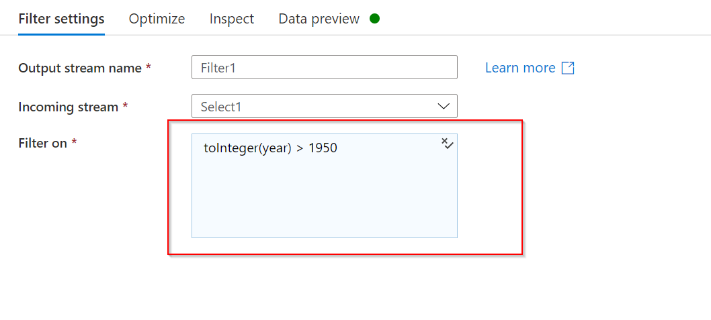
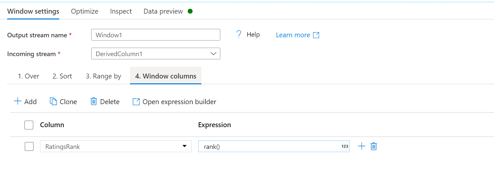

## Exercise 3: Transforming Data with Mapping Data Flow
  

Now that you have moved the data into Azure Data Lake Store Gen2, you are ready to build a Mapping Data Flow which will transform your data at scale via a spark cluster and then load it into a Data Warehouse. 

### Task 1: Preparing the environment

1. **Add a Data Flow activity** In the Activities pane, open the **Move and Transform** accordion and drag the **Data Flow** activity onto the pipeline canvas and connect with the **Copy data** activity we created earlier. 

    

2. Turn the **Data Flow Debug** slider located at the top of the authoring module on, and click **OK** in the **Turn on data flow debug** screen that appears.  

    > NOTE: Data Flow clusters take 5-7 minutes to warm up.

### Task 2: Adding a Data Source

1. Select the data flow activity in the pipeline workspace. In the lower pane, select the settings tab, click **+ New** for the variable **Dataflow**

1. **Add an ADLS source**: Click on the Mapping Data Flow object in the canvas. Go to the source settings tab. In the **Dataset** dropdown, select your **ADLS** dataset used in your Copy activity

    

    * If your dataset is pointing at a folder with other files, you may need to create another dataset or utilize parameterization to make sure only the moviesDB.csv file is read
    * If you have not imported your schema in your ADLS, but have already ingested your data, go to the dataset's 'Schema' tab and click 'Import schema' so that your data flow knows the schema projection.

    Once your debug cluster is warmed up, verify your data is loaded correctly via the **Data preview** tab. Once you click the refresh button, Mapping Data Flow will show calculate a snapshot of what your data looks like when it is at each transformation.
  
### Task 3: Using Mapping Data Flow transformation

1. **Add a Select transformation to rename and drop a column**: In the preview of the data, you may have noticed that the "Rotton Tomatoes" column is misspelled. To correctly name it and drop the unused Rating column, you can add a [Select transformation](https://docs.microsoft.com/azure/data-factory/data-flow-select) by clicking on the + icon next to your ADLS source node and choosing **Select** under Schema modifier.
    
    

    In the **Name as** field, under the **Select settings** tab, change 'Rotton' to 'Rotten'. To drop the Rating column, hover over it and click on the trash can icon.

    

2. **Add a Filter Transformation to filter out unwanted years**: Say you are only interested in movies made after 1951. You can add a [Filter transformation](https://docs.microsoft.com/azure/data-factory/data-flow-filter) to specify a filter condition by clicking on the **+ icon** next to your Select transformation and choosing **Filter** under Row Modifier. Click on the **expression box** to open up the [Expression builder](https://docs.microsoft.com/azure/data-factory/concepts-data-flow-expression-builder) and enter in your filter condition. Using the syntax of the [Mapping Data Flow expression language](https://docs.microsoft.com/azure/data-factory/data-flow-expression-functions), **toInteger(year) > 1950** will convert the string year value to an integer and filter rows if that value is above 1950.

    

    When you clicked on **open expression builder** you can verify your condition is working properly. This will also show by a check mark in the **Filter on** textbox.

    

3. **Add a Derive Transformation to calculate primary genre**: As you may have noticed, the genres column is a string delimited by a '|' character. If you only care about the *first* genre in each column, you can derive a new column named **PrimaryGenre** via the [Derived Column](https://docs.microsoft.com/azure/data-factory/data-flow-derived-column) transformation by clicking on the **+ icon** next to your Filter transformation and choosing **Derived Column** under Schema Modifier. Similar to the filter transformation, the derived column uses the Mapping Data Flow expression builder to specify the values of the new column.

    

    In this scenario, you are trying to extract the first genre from the genres column which is formatted as 'genre1|genre2|...|genreN'. Use the **locate** function to get the first 1-based index of the '|' in the genres string. Using the **iif** function, if this index is greater than 1, the primary genre can be calculated via the **left** function which returns all characters in a string to the left of an index. Otherwise, the PrimaryGenre value is equal to the genres field. You can verify the output via the expression builder's Data preview pane.

    - In the **Derived column's** settings tab, click **+Add** then, **Add column**, to add a column named **PrimaryGenre**. 
    - Under **Expression** open the **Expression builder**. 
    - Write iif(locate('|', genres)>1,left(genres,locate('|', genres)-1),genres)
    - Select **Save and finish**

4. **Rank movies via a Window Transformation** Say you are interested in how a movie ranks within its year for its specific genre. You can add a [Window transformation](https://docs.microsoft.com/azure/data-factory/data-flow-window) to define window-based aggregations by clicking on the **+ icon** next to your Derived Column transformation and clicking **Window** under Schema modifier. To accomplish this, specify what you are windowing over, what you are sorting by, what the range is, and how to calculate your new window columns. In this example, we will window over PrimaryGenre and year with an unbounded range, sort by Rotten Tomato descending, a calculate a new column called RatingsRank which is equal to the rank each movie has within its specific genre-year.

    - In the **Window settings** pane under the **Over** tab, select **PrimaryGenre** and add **year** by clicking on **+** and selecting **year** from the dropdown.

    

    - In the **Sort settings** pane, select the **Rotten Tomato** column, select **Descending** under **Order** and check **Nulls first**

    

   - In the **Range by settings** pane, leave all settings per default.

    

   - In the **Window columns settings** pane, rename the blank column to **RatingsRank** and enter as expression **rank()**

    

5. **Aggregate ratings with an Aggregate Transformation**: Now that you have gathered and derived all your required data, we can add an [Aggregate transformation](https://docs.microsoft.com/azure/data-factory/data-flow-aggregate) to calculate metrics based on a desired group by clicking on the **+ icon** next to your Window transformation and clicking **Aggregate** under Schema modifier. As you did in the window transformation, lets group movies by PrimaryGenre and year

    - Under the **Aggregate settings** tab, select **Group by**.
    - Using the dropdown select the column **Primary Genre** and add the **year** column by clicking **+**, and dropdown.
    
    

    In the Aggregates tab, you can aggregations calculated over the specified group by columns. For every genre and year, lets get the average Rotten Tomatoes rating, the highest and lowest rated movie (utilizing the windowing function) and the number of movies that are in each group. Aggregation significantly reduces the amount of rows in your transformation stream and only propagates the group by and aggregate columns specified in the transformation.

    - Under the **Aggregate settings** tab, now select **Aggregates**. Add the following columns by clicking **+** and then **Add column**, with their respective expressions:
        - AverageRating: avg(toInteger({Rotten Tomato}))
        - HighestRead: first(title)
        - LowestRead: last(title)
        - NumberOfMovies: count()

    

    * To see how the aggregate transformation changes your data, use the Data Preview tab
   

6. **Specify Upsert condition via an Alter Row Transformation** If you are writing to a tabular sink, you can specify insert, delete, update and upsert policies on rows using the [Alter Row transformation](https://docs.microsoft.com/azure/data-factory/data-flow-alter-row) by clicking on the **+ icon** next to your Aggregate transformation and clicking **Alter Row** under Row modifier. Since you are always inserting and updating, you can specify that all rows will always be upserted.

    - From the dropdown next to **Alter row conditions** in the **Alter row settings** tab, please select **Upsert if**. In the expression write **true()**

    

    

### Task 4: Writing to a Data Sink

1. **Write to a Azure Synapse Analytics Sink**: Now that you have finished all your transformation logic, you are ready to write to a Sink.
    1. Add a **Sink** by clicking on the **+ icon** next to your Alter row transformation and clicking **Sink** under Destination.

    2. In the Sink tab, create a new data warehouse dataset via the **+ New button** next to **Dataset**.

    3. Select **Azure Synapse Analytics** from the tile list and click **Continue**

    4. Select **+New** under **Linked service**. Configure your Azure Synapse Analytics connection to connect to the DWDB database created in Module 5. 

    5. **Account selection method**: **From Azure subscription**

    6. **Azure subscription**: select the subscription used for this lab.

    7. **Server name**: select your **wrkspcxx** server. 

    8. **Database name**: **DWDB**

    9. **Authentication type**: **SQL authentication**

    10. For **username** use your server admin username, for **Password** use the corresponding password you provided, when setting up the service.

    11. Click **Create** when finished.
    

    12. In the **Set properties** page, select **Create new table** and enter in the schema of **dbo** and the  table name of **Ratings**. Click **OK** once completed.
    

    13. Since an upsert condition was specified, you need to go to the Settings tab and select **Allow upsert**.
    
    14. For **Key columns** select **List of Columns** and add through **+** the two columns PrimaryGenre and year. based on key columns PrimaryGenre and year.
    

    15. In the **Mapping** pane make sure you untick **Auto mapping**. 

At this point, You have finished building your 8 transformation Mapping Data Flow. It's time to run the pipeline and see the results!

## Task 5: Running the Pipeline

1. Go to the pipeline1 tab in the canvas. Because Azure Synapse Analytics in Data Flow uses [PolyBase](https://docs.microsoft.com/sql/relational-databases/polybase/polybase-guide?view=sql-server-2017), you must specify a blob or ADLS staging folder. In the **Settings** tab of the data flow, open up the **Staging** accordion and select your ADLS linked service and specify a staging folder path such as **data/dw-staging**.

    

2. Before you publish your pipeline, run another debug run to confirm it's working as expected. Looking at the **Output** tab, you can monitor the status of both activities as they are running.

3. Once both activities succeeded, you can click on the eyeglasses icon next to the Data Flow activity to get a more in depth look at the Data Flow run.

4. If you used the same logic described in this lab, your Data Flow should have written 737 rows to your SQL DW.

5. To verify this number navigate to you Synapse workspace. 

6. In your Synapse workspace, navigate to the **Data** hub. 

7. Under **Databases** select the **DWDB(SQL)** database and expand through the ellipses. 

8. Click the 3 dots next to the **DWDB(SQL)** database and select **New SQL script** followed by **Empty script**. Make sure the notebook is connected to **DWDB** and uses database **DWDB**. 
and paste: Select count(*) as TotalCount from dbo.Ratings

    

