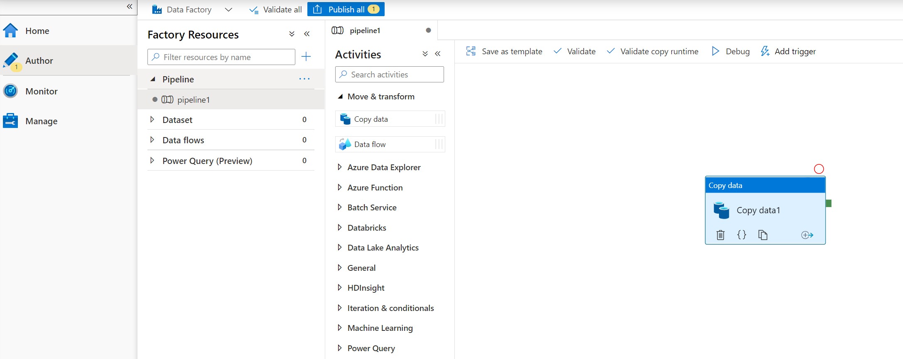
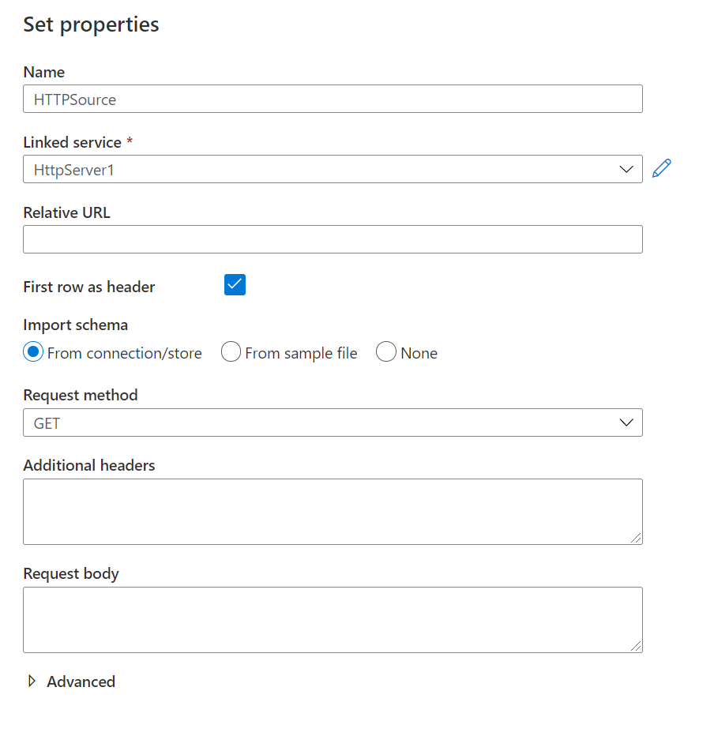
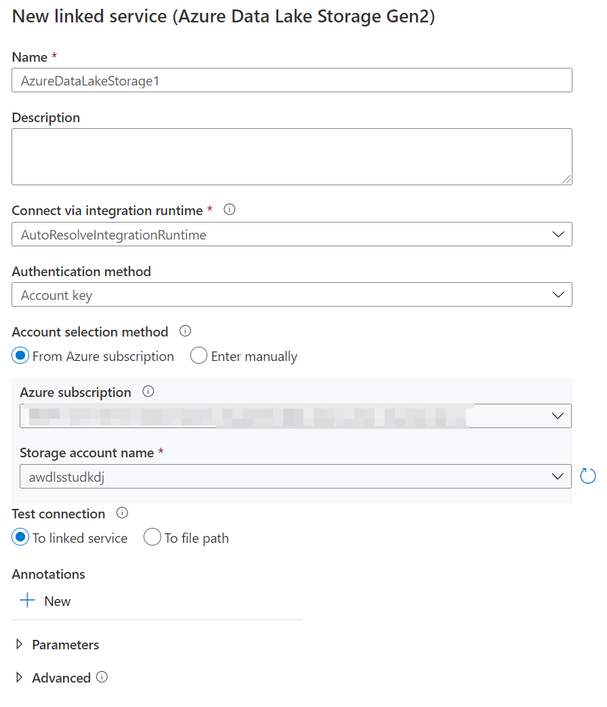
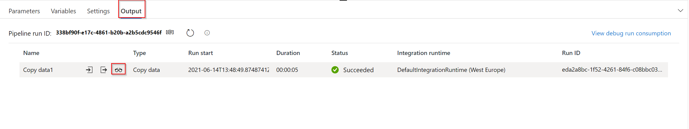

## Exercise 2: Ingest data using the Copy Activity
  
The main tasks for this exercise are as follows:

1. Add the Copy Activity to the designer

2. Create a new HTTP dataset to use as a source

3. Create a new ADLS Gen2 sink

4. Test the Copy Activity

### Task 1: Add the Copy Activity to the designer

1. Sign in to the Azure portal.

1. In the left pane, select Resource Groups.

1. Select the ADF resource gorup.

1. In the ADF resource group, select your Azure Data Factory to open it.

1. Select the **Open Azure Data Factory Studio** link.

1. Alternatively, for the previous steps, you can open the Azure Data Factory by visiting the link https://adf.azure.com/ and signing in.

3. Click on the **pencil icon** on the left sidebar and select the **+ pipeline button** to open the authoring canvas.

4. **Add a copy activity** In the Activities pane, open the **Move and Transform** accordion and drag the **Copy data** activity onto the pipeline canvas.

    

### Task 2: Create a new HTTP dataset to use as a source

1. In the Source tab of the Copy activity settings, click **+ New**

2. In the data store list, scroll down to select the **HTTP** tile and click **continue**

3. In the file format list, select the **DelimitedText** format tile and click **continue**

4. In **Set properties** blade, give your dataset a name such as **HTTPSource** and click on the **Linked Service** dropdown. Select **New**.

5. In the **New Linked Service (HTTP)** screen, copy the URL of the moviesDB csv file below in the **Base URL** textbox.  You can access the data with no authentication required using the following endpoint:

    https://raw.githubusercontent.com/Dimtemp/AzureDataFactory/master/labfiles/moviesDB.csv

6. In the **Authentication type** drop down, select **Anonymous**. and click on **Create**.

    -  Once you have created and selected the linked service, specify the rest of your dataset settings. These settings specify how and where in your connection we want to pull the data. As the url is pointed at the file already, no relative endpoint is required. As the data has a header in the first row, set **First row as header** to be true and select Import schema from **connection/store** to pull the schema from the file itself. Select **Get** as the request method. You will see the following screen

        
           
    - Click **OK** once completed.
   
    a. To verify your dataset is configured correctly, click **Preview data** in the Source tab of the copy activity to get a small snapshot of your data.
   
   

### Task 3: Create a new ADLS Gen2 dataset sink

1. Click on the **Sink tab**, and the click **+ New**

2. Select the **Azure Data Lake Storage Gen2** tile and click **Continue**. Please make sure you **did not** select Gen1 in this step.

3. Select the **DelimitedText** format tile and click **Continue**.

4. In Set Properties blade, give your dataset a name such as **ADLS** and click on the **Linked Service** dropdown. Select **New**.

5. In the New linked service (Azure Data Lake Storage Gen2) blade, select your authentication method as **Account key**, select your **Azure Subscription** and select your Storage account. You will see a screen as follows:

   

6. Click on **Create**

7. Once you have configured your linked service, you enter the set properties blade. As you are writing to this dataset, you want to point the folder where you want moviesDB.csv copied to. In the example below, I am writing to folder **output** in the file system **data**. While the folder can be dynamically created, the file system must exist prior to writing to it.

8. Set **First row as header** to be true. Select Import Schema: From file

9. Browse to the AzureDataFactory\Labfiles\moviesDB.csv file.

   

10. Click **OK** once completed.

### Task 4: Test the Copy Activity

At this point, you have fully configured your copy activity. To test it out, click on the **Debug** button at the top of the pipeline canvas. This will start a pipeline debug run.

1. To monitor the progress of a pipeline debug run, click on the **Output** tab of the pipeline

2. To view a more detailed description of the activity output, click on the eyeglasses icon. This will open up the copy monitoring screen which provides useful metrics such as Data read/written, throughput and in-depth duration statistics.

   

3. To verify the copy worked as expected, open up your ADLS gen2 storage account and check to see your file was written as expected.

