# Lab: Using the Azure Portal and SQL Server Management Studio
 
## Lab Overview 

Students will explore the Azure Portal and use it to create an Azure VM with SQL Server 2019 installed. Then they will connect to the virtual machine through Remote Desktop Protocol and use the SQL Server Management Studio. 

## Task 1: Provision a SQL Server on an Azure Virtual Machine 

1. From the lab virtual machine, if you are not already in the portal, start a browser session and navigate to [https://portal.azure.com](https://portal.azure.com/). 

	

 

2. In the Azure Portal, type subscription in the search bar at the top of the screen. Click on the subscriptions icon. (You may need to log in first.)

	

 

3. On the Subscriptions blade, you will have one or more subscriptions. Review your Subscription name, subscription ID, and your role. 

	

4. Launch the left navigation pane by clicking the horizontal lines next to Microsoft Azure in the top left of the portal. Then select All resources. 

	

	

 

5. The All resources page will list all Azure resources within your selected subscriptions. 

 

6. Select Resource groups in the left navigation.

	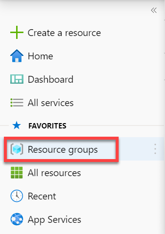

	

	The Resource groups blade will list all Azure resource groups within your selected subscriptions. 

7. On the Resource groups blade, select the Create button. 

	

 
8. Ensure you have selected the appropriate subscription for the lab. Name the resource group Sql2019. Select the nearest Azure region to your location. Select the Review + Create button. Once the review completes, select the Create button. 

	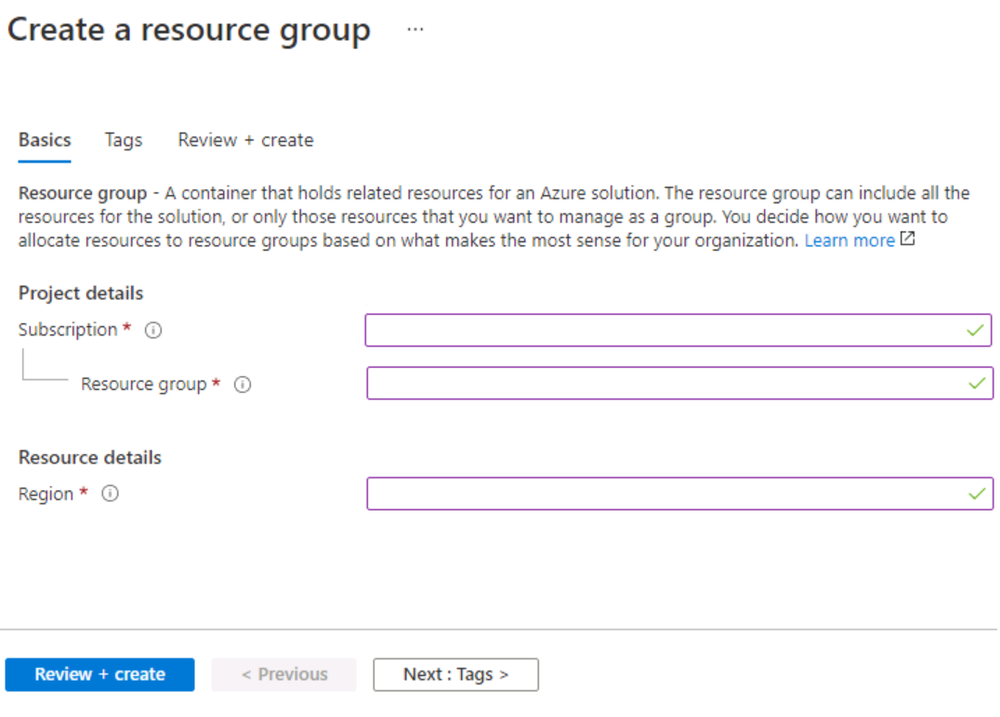

9. Locate the search bar at the top of the page. Search for Azure SQL. Select the search result for Azure SQL that appears in the results under Services.

	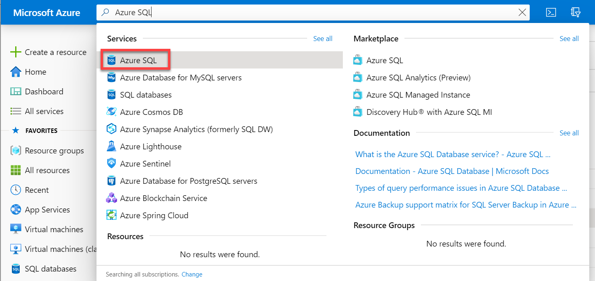

 

## Task 2: Provision a SQL Server on an Azure Virtual Machine

1. On the Azure SQL blade, select the Create button. 

	

2. On the Select SQL deployment option blade, open the drop-down box under SQL virtual machines. Select the option labeled Free SQL Server License: SQL 2019 Developer on Windows Server 2019. Then select the Create button.
	
	

3. On the Create a virtual machine blade, enter the following information: 

	- Subscription: **<Your subscription>**

	- Resource group: **Sql2019**

	- Virtual machine name:  **Sql2019**

	- Region: **West Europe**

	- Availability Options: **No infrastructure redundancy required**
	
	- Image: **Free SQL Server License: SQL 2019 Developer on Windows Server 2019 - Gen1**

	- Azure spot instance: **No**

	- Size: Standard **D2s_v3** (2 vCPUs, 8 GiB memory; you may need to select the "See all sizes" link to see this option)

	- Administrator account username: **your first name**

	- Administrator account password: **Pa55w.rd1234** (or your own password that meets the criteria)

	- Select inbound ports: **RDP (3389)**

	- Would you like to use an existing Windows Server license?: **No**

	Make note of the username and password for later use.

	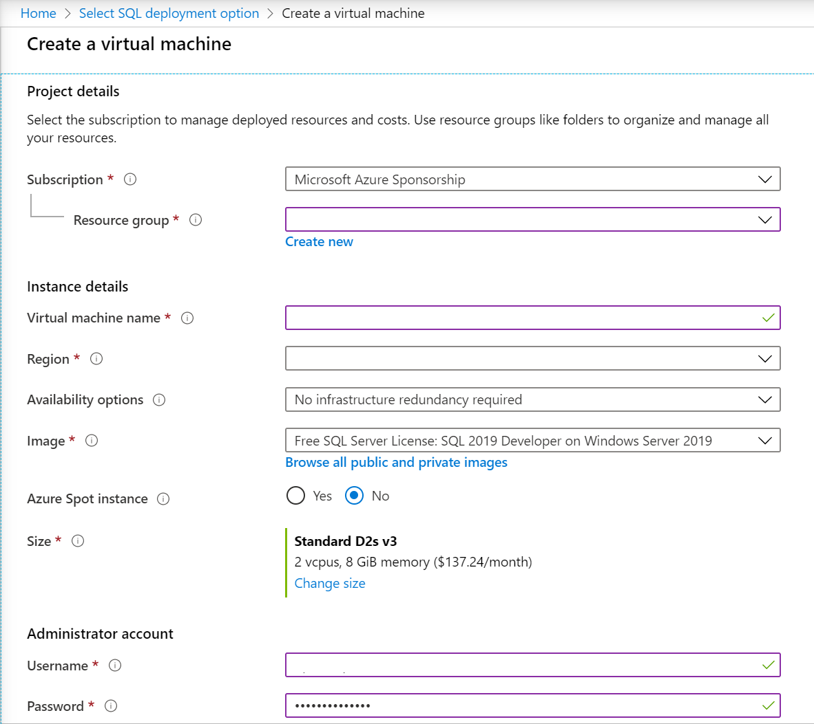

4. Navigate to the Disks tab and review the configuration. 

	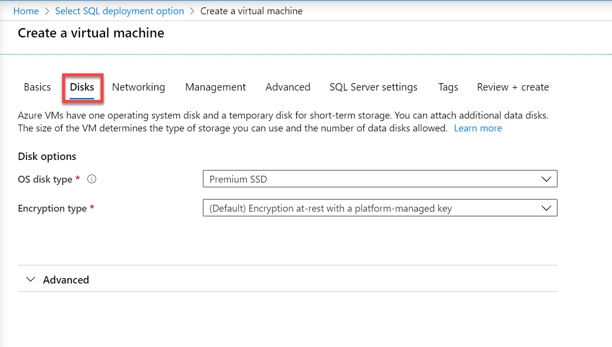

 
5. Navigate to the Networking tab and review the configuration. 

	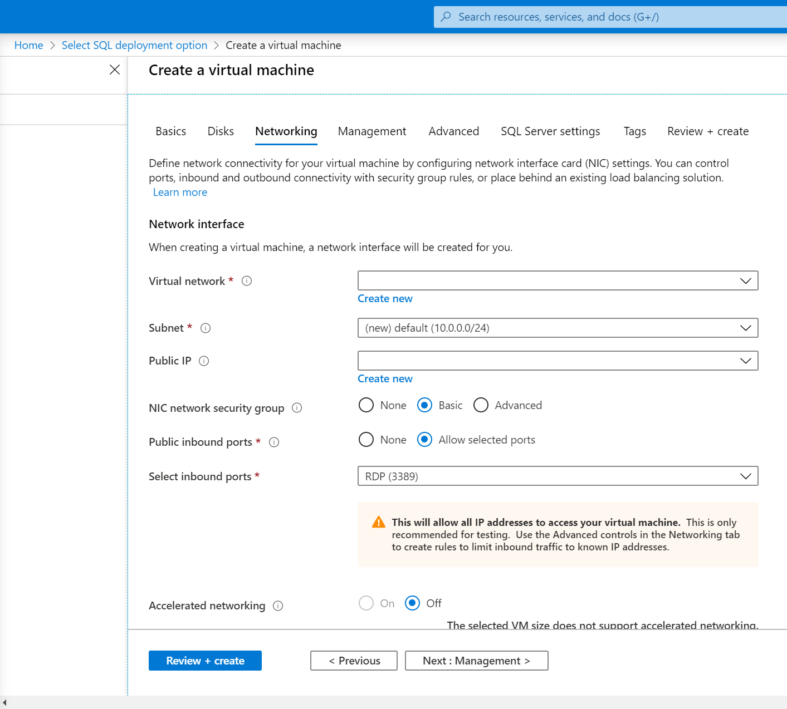
 

6. Navigate to the Management tab and review the configuration. 

	

	Please leave the auto shutdown optioen enabled at 19:00. If you forget to shut down the VM at the end of the day, it will automatically shut down at 19:00 and save you a lot of money. Understand that this is **not** desirable in a production environment! ;-)

7. Navigate to the Advanced tab and review the configuration. 

	

8. Navigate to the SQL Server settings tab and review the configuration. 

	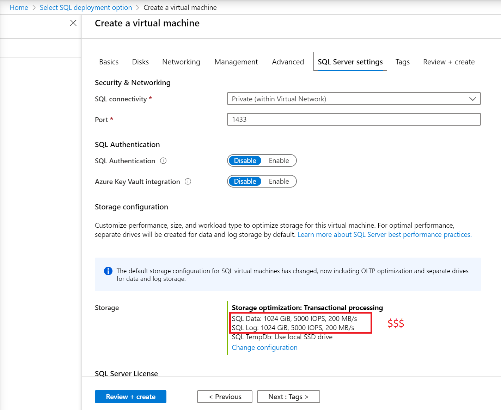

	By default, the SQL Server Azure VM templates create one premium disk with read caching for data, one premium disk without caching for transaction log, and uses the local SSD (D:\ on Windows) for tempdb.

	Reconfigure both data and transaction log disks for 8 GB of disk space. 

	Please notice! If you fail to reconfigure the disks, it will costs you a lot of money since the default size per disk is 1 TB. This might stop you from performing additional exercises.

9. Select the Review + create button. Then select the Create button.  

    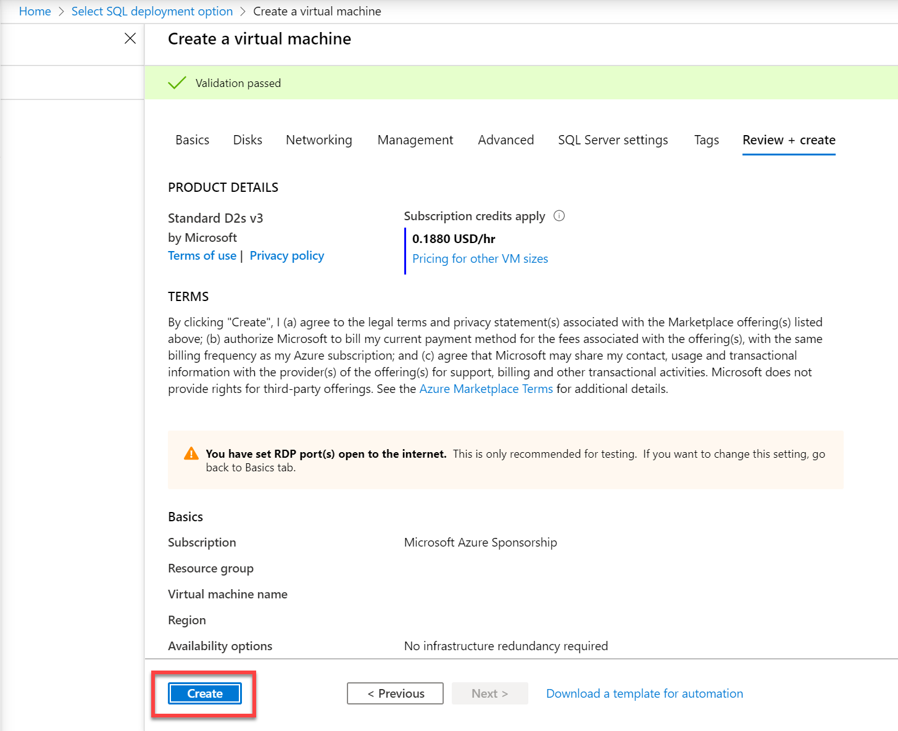

10. On the deployment blade, wait until the deployment is complete. The VM will take approximate 5-10 minutes to deploy. Then select the Go to resource button. 

	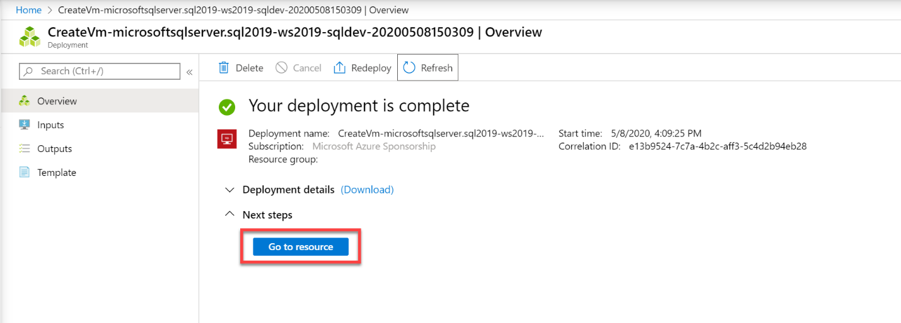

 
11. On the overview page for the virtual machine, scroll through the menu options for the resource to review what is available.

	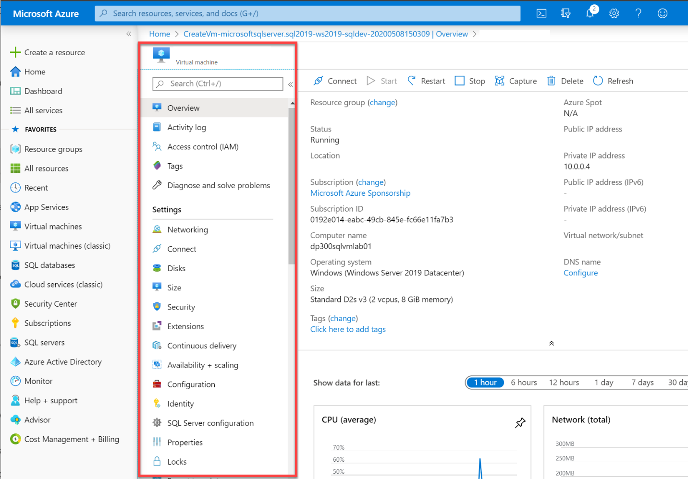

# Exercise 2: Connect to the VM and run SQL Server Management Studio
 
## Task 1: Connect to the Virtual Machine

1. On the Overview page for the virtual machine, select the Connect button and choose RDP. 

	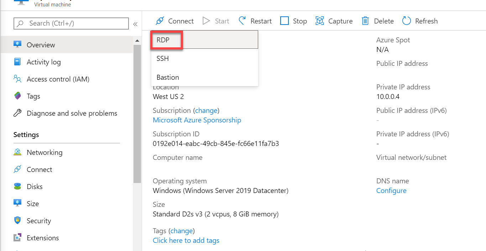

 
2. On the RDP tab, select the Download RDP File button. 

	

3. Open the RDP file that was just downloaded. When a dialog appears asking if you want to connect, select the Connect button.   
	

 
4. In the Windows Security dialog if you receive the PIN dialog, select More choices. Then choose Use a different account. If you don’t receive the PIN dialog, you can proceed to Step 5.

	

 
5. Enter the username and password selected during the virtual machine provisioning process. Then select the OK button.

	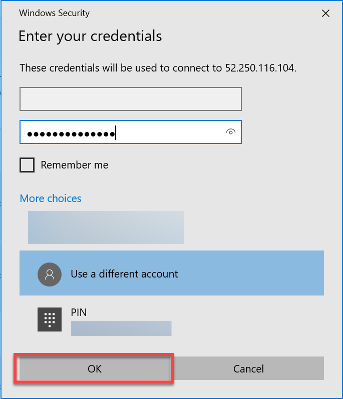

 
6. When the Remote Desktop Connection dialog appears asking if you want to connect, select the Yes button. 

	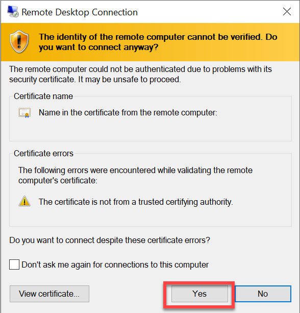

7. A Remote Desktop window will open. On the right, select the No button to indicate you do not want the computer to be discoverable by other devices on the network. Close the small Server Manager popup dialog by clicking the X in the top right of the box. Keep the big Server Manager Window open.

	

 
8. In the Server Manager window, select Local Server on the left and then select On next to IE Enhanced Security Configuration. 

	

 
9. When the Internet Explorer Enhanced Security Configuration dialog appears, set Administrators to Off. Then select the OK button.

	

 
 
## Task 2: Restore the Database and Verify its Availability

1. Open Internet Explorer by selecting the icon from the task bar. 

	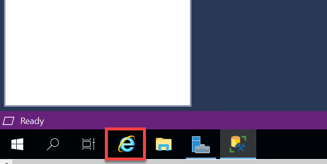

1. In Internet Explorer, navigate to the following URL: 

	[https://github.com/Microsoft/sql-server-samples/releases/download/adventureworks/AdventureWorksDW2017.bak](https://github.com/Microsoft/sql-server-samples/releases/download/adventureworks/AdventureWorksDW2017.bak)

	

	A dialog will appear asking if you would like to run or save the file.   
	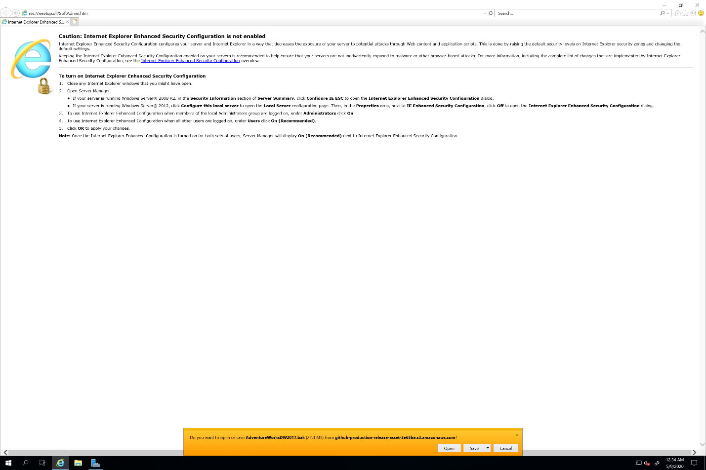

 

1. In the dialog, select the dropdown next to Save and choose Save As. 

	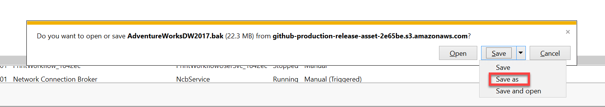

 
1. Select the Windows Start button and type SSMS. Select Microsoft SQL Server Management Studio 18 from the list.  

	

2. When Management Studio opens, the Connect to Server dialog will be pre-populated to the local machine. Select the Connect button. 

	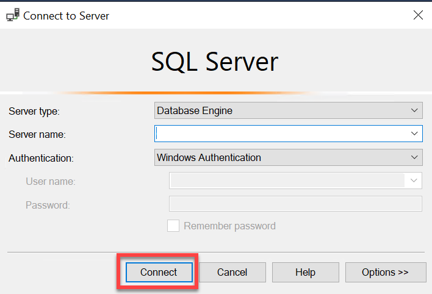
