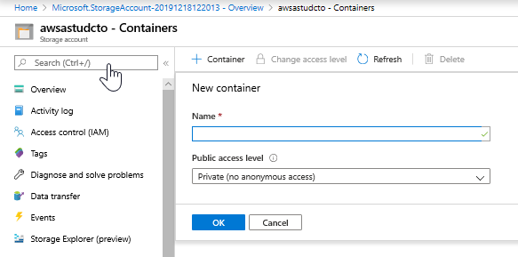

# Lab: Working with Data Storage

## Lab overview

Students will be able to create Azure storage accounts and Data Lake Storage accounts and explain the difference between a storage account and and a data lake. They will also be able to demonstrate how to perform data loads into the data storage of choice.

## Task 1: Create an Azure Storage Account  

1. Browse to the Azure portal at [**http://portal.azure.com**](http://portal.azure.com) and sign in.

1. In the Azure portal, at the top left of the screen, click on the **Home** hyperlink

2. In the Azure portal, click on the **+ Create a resource** icon.

3. In the New screen, click **Storage account** in the list that appears.

4. In the **Storage account** screen, click **Create**.

5. From the **Create a storage account** screen in the **Basics** tab, create the first storage account with the following settings:

    - Under the project details, specify the following settings:

        - **Subscription**: select your subscription.
    
        - **Resource group**: click new, and type **ADF**.

    - Under the Instance details, specify the following settings:
    
        - **Storage account name**: **storxxxxx**, where **xxxxx** is a random number. For example: **stor73542**. Storage account names must be between 3 and 24 characters in length and may contain numbers and lowercase letters only. Please keep in mind this is (part of) a FQDN. So the name needs to be globally unique.

        - **Region**: **West Europe**.

        - **Performance**: **Standard**. This type of account is recommended by Microsoft for most scenarios. Please keep in mind that Premium performance only allows you to select Locally Redundant Storage.

        - **Redundancy**: **Geo-redundant storage (GRS)**

        - Select **Make read access to data available in the event of regional unavailability.**

            

6. Click **Review + create**.

7. After the validation of the **Create storage account*** screen, click **Create**.

   > **Note**: The creation of the storage account will take a minute.

## Task 2: Create and configure a container within the storage account.

1. In the Azure portal, a message states that _Deployment succeeded_, click on the button **Go to resource**.

2. Under the **Data storage** section, click **Containers**.

3. In the containers screen, at the top left, click on the  **+ Container** button.

4. From the **New Container*** screen, create a container with the following settings:

    - Name: **data**.

    - Public access level: **Private (no anonymous access)**

        

5. In the **New Container** screen, click **Create**.

   > **Note**: The creation of the container is immediate and will appear in the list.

## Task 3: Upload some files to the data container of the storage account.

1. In the Azure portal, in the **Containers** screen, click on the **data** container in the list.

2. In the **data** screen, click on the **Upload** button.

3. In the **Upload blob** screen, in the Files text box, click on the **folder** icon to the right of the text box.

4. In the **Open** dialog box, browse to  C:\Windows\ folder. Select the following file: win.ini.

5. In the **Open** dialog box, click **Open**. 

6. In the **Upload blob** screen, click on the **Upload** button.

7. Close the **Upload blob** screen, and close the **data** screen.

8. Close the **Containers** screen, and in the Azure portal, navigate to the **Home** screen. 

> **Result**: After you completed this exercise, you have created a Storage account that has a container named data that contains the win.ini file.

## Task 4: Create and configure a storage account as a Data Lake Store Gen II store.

1. In the Azure portal, click on **+ Create a resource** icon.

2. In the New screen, click in the **Search services and marketplace** text box, and type the word **storage**. Click **Storage account** in the list that appears.

3. In the **Storage account** blade, click **Create**.

4. From the **Create a storage account*** blade, create a storage account with the following settings:

    - Under the project details, specify the following settings:

        - **Subscription**: the name of the subscription you are using in this lab
    
        - **Resource group name**: **ADF**.

    - Under the instance details, specify the following settings:

        - **Storage account name**: **adlsxxxxx**, where **xxxxx** is a random number. For example: **adls73542**. Storage account names must be between 3 and 24 characters in length and may contain numbers and lowercase letters only. Please keep in mind this is (part of) a FQDN. So the name needs to be globally unique.

        - **Region**: the name of the Azure region which is closest to the lab location and where you can provision Azure VMs.

        - **Performance**: **Standard**.

        - **Redundancy**: **Geo-redundant storage (GRS)**

         - Select **Make read access to data available in the event of regional unavailability.**       

5. Click on the **Advanced** tab.

6. Under Data Lake Storage Gen2, check the checkbox for **Enable hierarchical namespace**.

    

7. In the **Create a storage account** blade, click **Review + create**.

8. After the validation of the  **Create storage account*** blade, click **Create**.

   > **Note**: The creation of the storage account might take approximately 1 minute.

## Task 5: Create and configure a Container within the storage account.

1. In the Azure portal, a message states that _Deployment succeeded_, click on the button **Go to resource**.

2. In the **adlsxxxxx** screen, click **Containers**.

3. In the **Containers** screen, at the top left, click on the  **+ Containers** button.

4. From the **New** screen, create a container with the following name:

    - Name: **logs** with the public access level of **Private (no anonymous access)**.

5. In the **New Container** screen, click **Create**.

   > **Note**: The creation of the file system is immediate and will appear in the list of the **Containers** screen.

> **Result**: After you completed this exercise, you have created a Data Lake Gen2 Storage account that has a file system named logs.

## Task 6: Connect Storage Explorer to Azure.
  
1. From the Azure VM, Open Storage Explorer (icon is in the taskbar).

2. In Storage Explorer, select **Manage Accounts** to go to the **Account Management Panel**.

3. The left pane now displays all the Azure accounts you've signed in to. To connect to another account, select **Add an account**

4. Select **Subscription**

5. Select the Azure environment you will use to sign in

6. You will be redirect to a login page

7. Select your account where the following pop up message should show up **Authenticated. You can return to Storage Explorer. You might need to authenticate again if you close this browser tab**

8. After you successfully sign in with an Azure account, the account and the Azure subscriptions associated with that account are added to the left pane. Select the Azure subscriptions that you want to work with, and then select **Open explorer**. The left pane displays the storage accounts associated with the selected Azure subscriptions.

    

## Task 7: Upload data files to the data and logs container of the Data Lake Gen II Storage Account.

1. In Azure Storage Explorer, click on the arrow to expand your subscription.

2. Under **Storage Accounts**, search for the storage account **adlsxxxxx (ADLS Gen2)**, and click on the arrow to expand it.

3. Under **Blob Containers**, click on the arrow to expand it and show the **logs** file system. Click on the **logs** file system.

4. In Azure Storage Explorer, click on the arrow of the **Upload** icon, and click on the **Upload Files..**.

5. In Upload Files dialog box, click on the ellipsis next to the **Selected files** text box.

6. In the **Choose files to upload** dialog box, browse to the C:\Windows\ folder. Highlight the following file:

    - WindowsUpdate.log

7. In the **Choose files to upload** dialog box, click **Open**.

8. In the **Upload Files** screen, click on the **Upload** button.

   

> **Result**: After you completed this exercise, you have created a Data Lake Gen II Storage account named **adlsxxxxx** that has a file system named **logs** that contains a log file that is ready to be used by the Data scientists at AdventureWorks.
