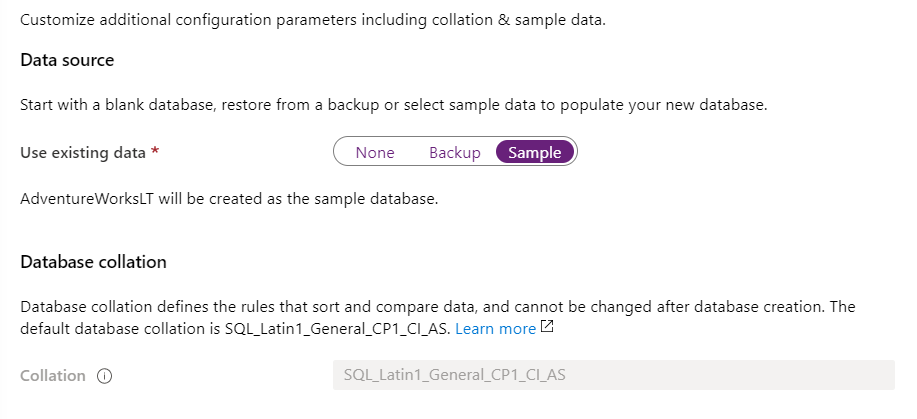
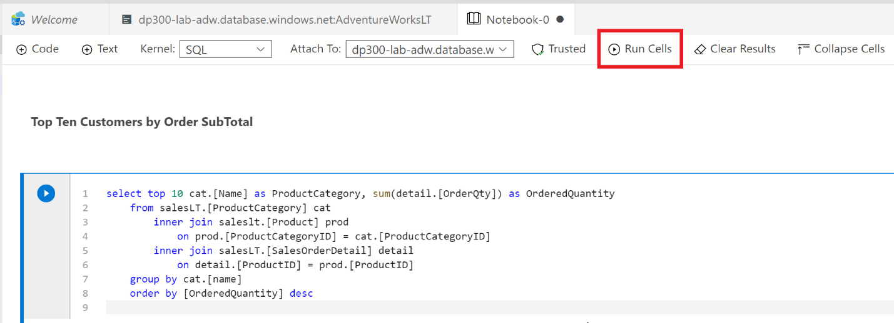

# Lab: Deploying PaaS databases

# Lab Overview

The student will configure basic resources needed to deploy an Azure SQL Database. Connectivity to the SQL Database will be validated using Azure Data Studio from the lab VM.


## Task 1: Deploy an Azure SQL Database

1. From the Azure Portal, click on **+ Create a Resource** at the top of the left side navigation bar  

	

2. Search for "SQL databases" in the search box at the top, then click **SQL Databases** from the list of options  

	

3. Click the **Create** button

4. Complete the Create SQL Database Basics screen with the following inputs and then click **Next: Networking**

	- Subscription: Select the lab subscription

	- Resource Group: **ADF**

	- Database Name: **AdventureWorksLT**
	
	- Server: click **Create new.** In the New Server sidebar, complete the form as follows:

		- Server name: **sqlxxxxx** where **xxxxx** is a random number. For example: **sql73542**. Please keep in mind this is (part of) a FQDN. So the name needs to be globally unique.
		
		- Location: **West Europe**

		- Server admin login: **yourfirstname**

		- Password and Confirm password: **Pa55w.rd**

		- Your New server sidebar should look similar to the one below. Click **OK**

		

    -  On the Create SQL Database page, make sure **Want to use Elastic Pool** is set to **No**

    -  Compute + Storage: Click **Configure database**

		- On the Configure screen, for Service tier dropdown, select **Basic**

		

		- Click **Basic**

		- Click the **Apply** button

**Note: Make note of this server name, and your login information. You will use it in subsequent labs.**

5. If you see the option **Backup storage redundancy**, keep the default value: **Geo-redundant backup storage**. 

6. Review settings and then click **Next: Networking**  

	

11. Click the **Next: Security** button, and then **Next: Additional settings** button.  

12. On the Additional Settings page, select the following options:

	- Set Use existing data to **Sample**

	

13. Click **Review + Create**

14. Review the settings before clicking **Create**

15. Once the deployment is complete, click the **Go to resource** button  


## Task 2: Enable All Azure Services access to new SQL Server

1. From the SQL Database blade, click on the link for the Server name in the top section  

	

2. On the SQL Server object’s navigation blade, click **Firewalls and virtual networks** under **Security**

	

3. Set **Allow Azure services and resources to access this server** to **Yes**  

	

4. Click **Save**, and then click **OK** on the Success message pane.

# Exercise 3: Connect to Azure SQL Database

## Task 1: Register Azure SQL Database Instance in Azure Data Studio

1. Launch Azure Data Studio (ADS) from the lab VM

	- You may see this pop-up at initial launch of Azure Data Studio. If you receive it, click **Yes**  


2. When Azure Data Studio opens, click the **Connections** button in Azure Data Studio’s left sidebar, then the **Add Connection** button
	
	

3. In the **Connections** sidebar, fill out the Connection Details section with connection information to connect to the SQL database created in the previous Exercise

	- Connection Type: **Microsoft SQL Server**

	- Server: Enter the name of the SQL Server created in Exercise 2, Task 1. For example: **dp300-lab-xx.database.windows.net**  
	[Note that you were asked to create a server name with your initials, instead of ‘xx’]

	- Authentication Type: **SQL Login**

	- User name: **dp300admin**

	- Password: **dp300P@ssword!**

	- Expand the Database drop-down to select **AdventureWorksLT.** 
	    - **NOTE:** You may be asked to add a firewall rule that allows your client IP access to this server. If you are asked to add a firewall rule, click on **Add account** and login to your Azure account. On Create new firewall screen rule screen, click **OK**.
		
	    
	    
    Back on the Connection sidebar, continue filling out the connection details:  
	
	- Server group will remain on **&lt;default&gt;**

	- Name (optional) can be populated with a friendly name of the database, if desired

	- Review settings and click **Connect**  

	

4. Azure Data Studio will connect to the database and show some basic information about the database, plus a partial list of objects  

	

## Task 2: Query Azure SQL Database with a SQL Notebook

1. In Azure Data Studio, connected to this lab’s AdventureWorksLT database, click the **New Notebook** button  

	

2. Click the **+Text** button to add a new text box in the notebook  

	


**Note:** Within the notebook you can embed plain text to explain queries or result sets.

3. Enter the text **Top Ten Customers by Order SubTotal**, making it Bold if desired  

	

4. Click the **+ Code** button to add a new cell at the end of the notebook to put a query in  

	

5. Paste the following SQL statement into the new cell

```sql
select top 10 cust.[CustomerID], cust.[CompanyName], sum(sohead.[SubTotal]) as OverallOrderSubTotal

  from [SalesLT].[Customer] cust

    inner join [SalesLT].[SalesOrderHeader] sohead

        on sohead.[CustomerID] = cust.[CustomerID]

   group by cust.[CustomerID], cust.[CompanyName]

   order by [OverallOrderSubTotal] desc
   ```

6. Click on the blue circle with the arrow to execute the query. Note how the results are included within the cell with the query.

7. Click the **+ Text** button to add a new text cell.

8. Enter the text **Top Ten Ordered Product Categories**, making it Bold if desired

9. Click the **+ Code** button again to add a new cell, and paste the following SQL statement into the cell

```sql
select top 10 cat.[Name] as ProductCategory, sum(detail.[OrderQty]) as OrderedQuantity

	from salesLT.[ProductCategory] cat

	   inner join saleslt.[Product] prod
      
	      on prod.[ProductCategoryID] = cat.[ProductCategoryID]

	   inner join salesLT.[SalesOrderDetail] detail

	      on detail.[ProductID] = prod.[ProductID]

	group by cat.[name]

	order by [OrderedQuantity] desc
```
10.  Click on the blue circle with the arrow to execute the query 

11. To run all cells in the notebook and present results, click the **Run Cells** button in the toolbar  

	

