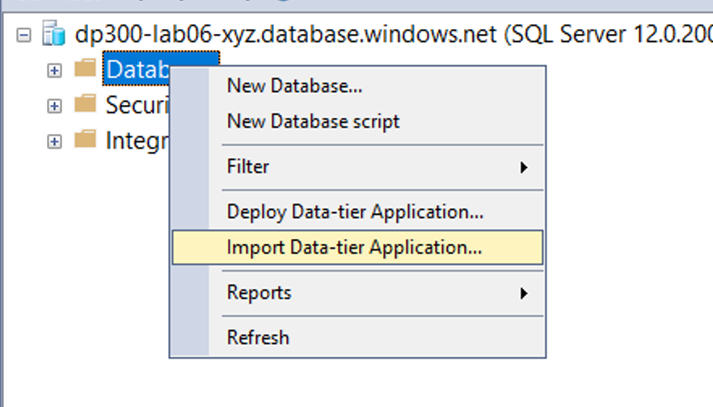
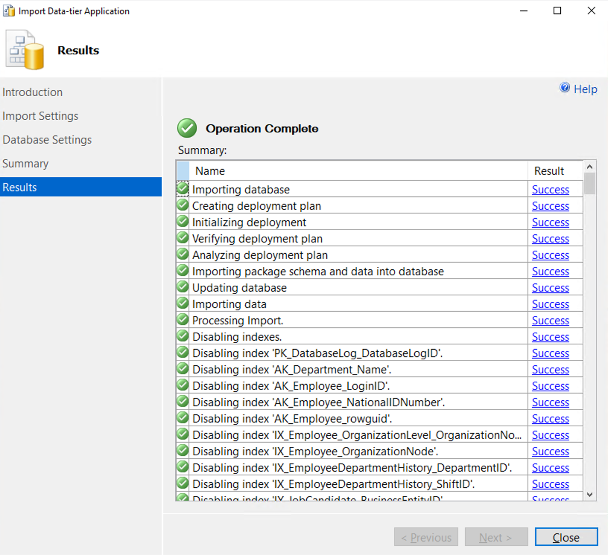
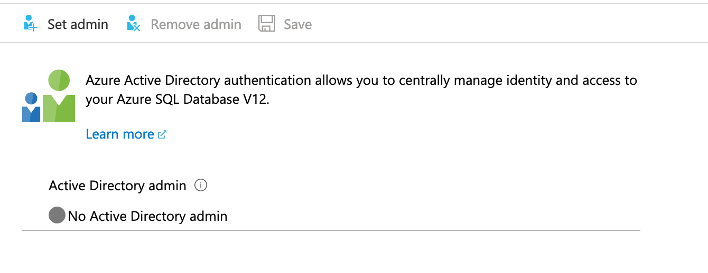

# Lab: Implement a Secure Environment
 
**Prerequisites**: An Azure SQL server you created in the lab for Module 2. Azure Active Directory access in the subscription.  

**Lab files**: The files for this lab are in the D:\Labfiles\Secure Environment folder.

# Lab overview

The students will take the information gained in the lessons to configure and subsequently implement security in the Azure Portal and within the AdventureWorks database. 

# Lab objectives

After completing this lab, you will be able to:

1. Configure an Azure SQL Database Firewall

2. Authorize Access to Azure SQL Database with Azure Active Directory


# Scenario

You have been hired as a Senior Database Administrator help ensure the security of the database environment. These tasks will focus on Azure SQL Database. 

**Note:** The exercises ask you to copy and paste T-SQL code. Please verify that the code has been copied correctly, with the proper line breaks, before executing the code. 

## Exercise 1: Configure an Azure SQL Database Firewall and connect to a new database

1. From the lab virtual machine, start a browser session and navigate to [https://portal.azure.com](https://portal.azure.com/). Provide appropriate credentials. 

	

2. In the search bar at the top of the Azure Portal, type SQL. The SQL servers icon will appear. Click on SQL servers. Click on the server name to be taken to the detail page for the server you created in Lab 2

	

3. In the detail screen for your SQL server, move your mouse to the right of the server name, and click copy to clipboard button as shown below.

	

4. Click on Show firewall settings (above the server name that you just copied). Click on **+ Add client IP** as highlighted below and then click Save.

    

	This will allow you to connect to your Azure SQL Database server using SQL Server Management Studio or any other client tools. **Important:** Make note of your client IP address, you will use it later in this task.

5. Open SQL Server Management Studio on the lab VM. Paste in the name of your Azure SQL database server and login with the credentials you created in Lab 2:

	- Server name: **&lt;_paste your Azure SQL database server name here_&gt;** 
         
	 - Authentication: **SQL Server Authentication**  
	
	- Server admin login: **dp300admin**

	- Password: **dp300P@ssword!**

	

	Click **Connect**.

6. In Object Explorer expand the server node, and right click on databases. Click Import a Data-tier Application.

	

7. In the Import Data Tier Application dialog, click Next on the first screen. 

	

8. In the Import Settings screen, click Browse and navigate to D:\Labfiles\Secure Environment folder and click on the AdventureWorks.bacpac file and click open. Then in the Import Data-tier application screen click **Next**.

	

	

9. On the database settings screen, change the edition of Azure SQL Database to General Purpose. Change the Service Objective to **GP_Gen5_2** and click **Next**. 

	

10.  On the Summary screen click **Finish**. When your import completes you will see the results below. Then click **Close**
	

11. In Object Explorer, expand the Databases folder. Then right-click on AdventureWorks and click on new query. 

	

12. Execute the following T-SQL query by pasting the text into your query window. **Important:** Replace 192.168.1.1. with your client IP address from Step 4. Click execute or press F5.

	```sql
	EXECUTE sp_set_database_firewall_rule @name = N'ContosoFirewallRule',

	@start_ip_address = '192.168.1.1', @end_ip_address = '192.168.1.1'
	```

13. Next you will create a contained user in the AdventureWorks database. Click New Query and execute the following T-SQL. Ensure that you are still using the AdventureWorks database. If you see master in the database name box below, you can pull down and switch to AdventureWorks.

	```sql
	CREATE USER containeddemo WITH PASSWORD = 'P@ssw0rd!'
	```
    
    
    Click **Execute** to run this command. This command creates a contained user within the AdventureWorks database. You will login using the username and password in the next step.
    
14. Navigate to the Object Explorer. Click on **Connect** and then **Database Engine**.

	

15. Attempt to connect with the credentials you created in step 13. 
    You will need to use the following information:  
	-  **Login:** containeddemo   
	-  **Password:**  P@ssw0rd! 
	 
     Click **Connect**.
	 
     You will see the following error.

	

	This error is generated because the connection attempted to login to the master database and not AdventureWorks where the user was created. Change the connection context by clicking **OK** to exit the error message and then clicking on **Options >>** in the Connect to Server dialog box as shown below.

	

16. On the connection options tab, type the database name AdventureWorks. Click **Connect**.

	

17. Another database should appear in the Object Explorer. 

    

    Make sure the selection stays on the newly added database. Then click **Connect** from the Object Explorer and **Database Engine**. 
    Enter the following again: 
    - **Login:** containeddemo   
	- **Password:**  P@ssw0rd! 

    Click **Connect**.

    This time the connection bypasses the master database and logs you directly into AdventureWorks, which is the only database to which the newly created user has access.

## Exercise 2: Authorize Access to Azure SQL Database with Azure Active Directory

1. Navigate to the Azure Portal, and click on your user name in the top right corner of the screen.

	

	Make note of the user name. 
	
	**Important:** A Microsoft account (a user account from Outlook, Gmail, Hotmail or Yahoo, for example) is **not supported** for the Azure Active Directory administrator for Azure SQL Database. As a workaround, you can create an Azure Active Directory group named DBA and add your user account to it. Alternatively, you can skip Exercise 2.

2. In the Azure Portal navigate to your Azure SQL Database server **dp300-lab-xx** and click on **Not Configured** next to Active Directory Admin.

	

	On the next screen, click **Set admin**.

	

3. In the Set admin screen, search for your username. When you have found it, click on it to highlight the username, and then click **Select**. You will be returned to the above Active Directory Admin screen. Click **Save** to complete the process. This will make your username the Azure Active Directory admin for the server as shown below

	

4. Open SQL Server Management Studio and click **Connect**, then **Database Engine**. In the server name enter the name of your server. Change the authentication type to Azure Active Directory Universal with MFA.

	

	You will be prompted to enter your Azure Active Directory password, and will you click **Connect**, you'll be logged in to your database. 
