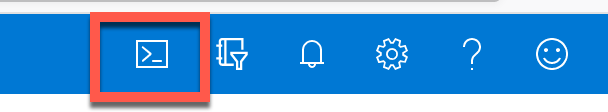
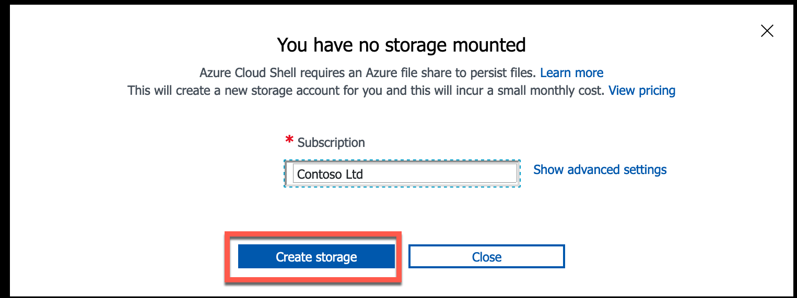
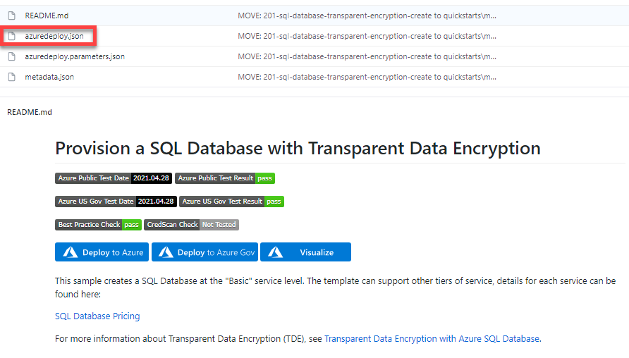
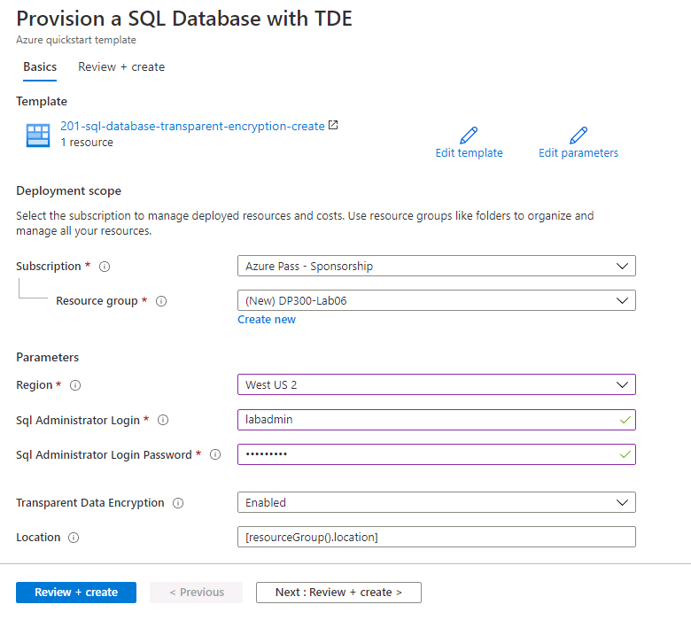
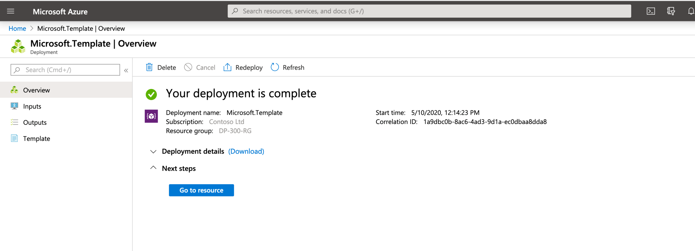

# Lab: Automate Resources

This lab can be performed from a web browser with access to the Azure portal.

Note: the Microsoft.Insights module needs to be added to your subscription in order to complete this lab. You can register by completing the following steps.

From the Azure portal, click on the cloud shell icon on the top right of the portal.



A shell will open at the bottom of the screen. Click on PowerShell as shown below.


You may be prompted to create a storage account. Click Create Storage.



After the PowerShell window opens, paste in the following command and press Enter.

```sql
register-AzResourceProvider -ProviderNamespace Microsoft.Insights
```


**Lab files**: The files for this lab are in the D:\LabFiles\Automate Resources folder.

# Lab overview

The students will take the information gained in the lessons to configure and subsequently implement automate processes within AdventureWorks.

# Lab objectives

After completing this lab, you will be able to:

- Deploy an Azure resource from a GitHub Quickstart template

- Configure performance metric related notifications


# Scenario

You have been hired as a Senior Data Engineer to help automate day to day operations of database administration. This automation is to help ensure that the databases for AdventureWorks continue to operate at peak performance as well as provide methods for alerting based on certain criteria. AdventureWorks utilizes SQL Server in both Infrastructure as a Service and Platform as a Service offerings.

# Exercise 1: Deploy an Azure Quickstart Template 

Estimated Time: 30 minutes

Individual Exercise

The main task for this exercise are as follows:

- Deploy an Azure resource from a GitHub Quickstart template

## Task: Deploy an Azure SQL Database from a template

1. Navigate to the following GitHub using a web browser.

    [https://github.com/Azure/azure-quickstart-templates/tree/master/quickstarts/microsoft.sql/sql-database-transparent-encryption-create](https://github.com/Azure/azure-quickstart-templates/tree/master/quickstarts/microsoft.sql/sql-database-transparent-encryption-create)

    

    Click on azuredeploy.json, and review the file.

2. Navigate back to the above link (click the back arrow in the top left of the browser), and click on the Deploy to Azure button. You may be prompted to login to the Azure portal. Login with your supplied credentials.

3. You will see a screen like the one below. In order to deploy this template, you need to complete the blank fields.

    In the Resource Group field, click “Create New” and type **DP300-Lab06**, and then click OK. Change the region to a region near you. For the remaining fields, use the following values:

	- SQL Administrator Login: **labadmin**
	- SQL Administrator Login Password: **Azur3Pa$$**
	- Transparent Data Encryption: **Enabled**
	- Location: **[resourceGroup().location]**

    

4. Click Review + create, then click Create. Your deployment will begin. You can track the status of your deployment by clicking the bell (highlighted in the screenshot below) and then clicking on the Deployment in progress link in the Notifications pane.

    

    Your deployment will take approximately 5-10 minutes to deploy. If you have clicked on the link above, you will be able to track your deployment.

    

5. Upon completion, the screen will update with a link to your newly created resource.

    

    Click on the Go to resource link. You will be taken to the Azure Resource Group your deployment just created. You should see both a SQL server and a SQL database in the Resource group.  Make note of the name of your SQL server, as you will it in the next exercise.

    

# Exercise 2: Configure Performance Metrics Based Alerts

## Task: Creating an alert when CPU exceeds an average of 80 percent.

1. Navigate to portal.azure.com if you are not already there. You may need to login again. In the search bar at the top of the Azure Portal, type SQL, and click on SQL databases. Click on the database name: **sample-db-with-tde**.

    

2. On the main blade for the sample-db-with-tde database, navigate down to the monitoring section.

3. Click on **Alerts** as shown below. You'll see the screen below. Click on **+ Create**, and then on **Alert rule**.

    

4. You will notice that the resource is already populated for you with the SQL Server you created. Under the Condition section, click Add condition.

  

5. In the Configure signal logic fly out menu, select CPU percentage.

    

6. Supply a threshold value of 80. Click Done.

    

7. Under Action group section, click Add action groups

    

8. In the fly out for Action group, Click + Create action group.

    

    In the Create action group screen, type:
    - Action group name: **emailgroup**
    - Display name: **emailgroup**

    

    Select **Next: Notifications >**.

9. Then click on the drop down **Notification type** and select **Email/SMS message/Push/Voice** and enter the name DemoLab.

    

10. In the flyout screen on the right (shown in the image above), click the check box next to email, enter an email address and click OK. Then click on the Review + create button, and then click Create on the Create action group screen.

    From the Create alert rule screen, add an Alert rule with the name DemoAlert, and then click Create alert rule as show below.

    

