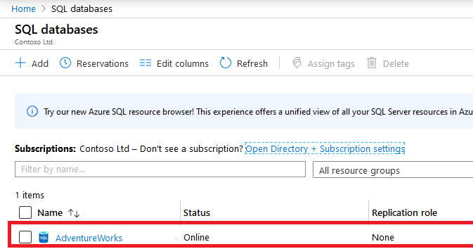
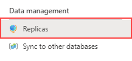
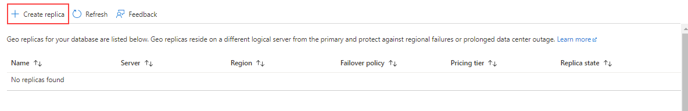
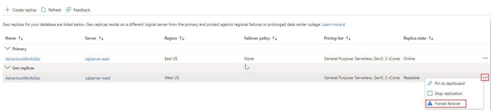

# Lab: Planning and Implementing a High Availability and Disaster Recovery Environment

**Pre-requisites**: Azure SQL Database

**Lab files**: The files for this lab are located in the D:\Labfiles\High Availability folder.

# Lab overview

The students will execute two main tasks: make Azure SQL Database geo-redundant, and backup to and restore from a URL which uses Azure. 

# Scenario

Now that you have automated day-to-day tasks in the previous lab, as the Senior Data Engineer, you are tasked with improving the availability of both IaaS and PaaS configurations for your database environment. You are tasked with the following objectives:

- Enable geo-replication for Azure SQL Database to increase availability for a database.

- Back up a database to a URL in Azure and restore it after a human error has occurred.

# Exercise 1: Enable Geo-Replication for Azure SQL Database

Overview

The Students will alter the configuration of the Azure SQL Database created during the lab for Module 3 to make it highly available.

Scenario

As a DBA within WideWorldImporters you need to know how to enable geo-replication for Azure SQL Database, ensure it is working, and know how to manually fail it over to another region using the portal.

Pre-requisites

- Azure account created for the student – must provide a login (e-mail) and password

- Azure SQL Database server and database pre-created

 

1. If you are not logged into the Azure portal via a browser window, do so using the Azure credentials provided to you.

2. From the menu, select SQL databases as shown below.

	

3. Click on the Azure SQL Database that was created in Lab 3. An example is shown below.

	

4. In the blade for the database, under Data management, select **Replicas**.

	

5. Then click on **Create replica** button on the top left side.

	

6. Under **Server**, select **Create New**. On the new server pane, enter a unique server name, a valid admin login, and a secure password, and select the region you chose as the target region and then click **OK** to create the server.

7. Back in the Geo-Replica blade, click **Review + Create**, and then click **Create**. The secondary server and the database will now be created. To check the status, look under the bell icon at the top of the portal. If successful, it will progress from Deployment in progress to Deployment succeeded.

8. Now that the Azure SQL Database is configured with replicas, you will perform a failover. Select the **Replicas** page for the secondary server and note that the primary and secondary servers are indicated.

9. Select the **...** menu for the secondary server and click **Forced Failover**.

	

10. When prompted, click **Yes**. 

	The status of the primary replica will switch to Pending and the secondary, Failover. The process will take a few minutes. When complete, the roles will switch with the secondary becoming the new primary and the old primary becoming the secondary.

