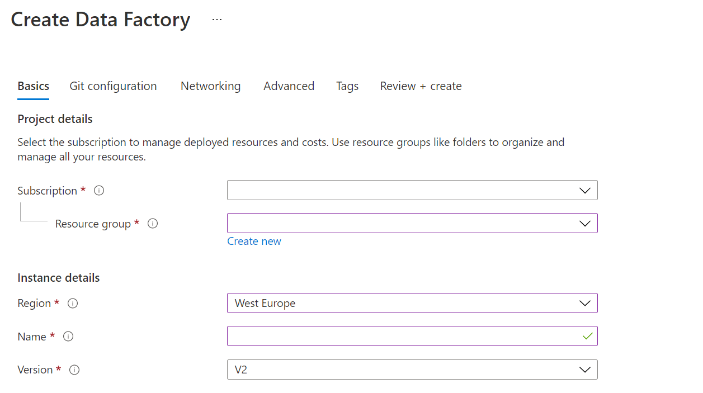

# Lab: Creating an Azure Data Factory

## Scenario
  
You are assessing the tooling that can help with the extraction, load and transforming of data into the data warehouse, and have asked a Data Engineer within your team to show a proof of concept of Azure Data Factory to explore the transformation capabilities of the product. The proof of concept does not have to be related to AdventureWorks data, and you have given them freedom to pick a dataset of their choice to showcase the capabilities.

## Exercise 1: Setup Azure Data Factory

Create your data factory: Use the [Azure Portal](https://portal.azure.com) to create your Data Factory. 

1. In Microsoft Edge, go to the Azure portal tab, click on the **+ Create a resource** icon, type **data factory**, and then click **Data Factory** from the resulting search, and then click **Create**.

2. In the New Data Factory screen, create a new Data Factory with the following options:
    - **Subscription**: Your subscription
    - **Resource group**: ADF
    - **Region**: **West Europe**
    - **Name**: my-data-factory
    - **Version**: V2
    - Leave other options to their default settings

        

3. In the **git configuration** blade **check** Configure git later. 

4. Click **review + create** and then select **create**.

> **Note**: The creation of the Data Factory takes approximately 1 minute.

1. On the deployment successful message, click on the button **Go to resource**.

> **Result**: After you completed this exercise, you have created an instance of Azure Data Factory

