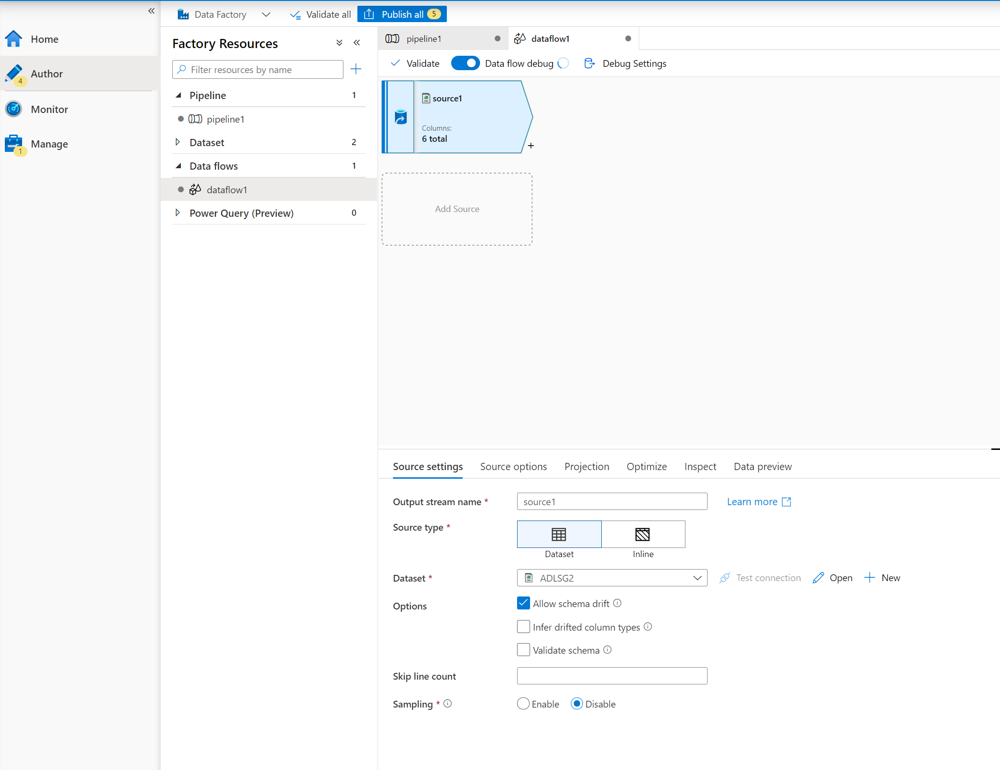
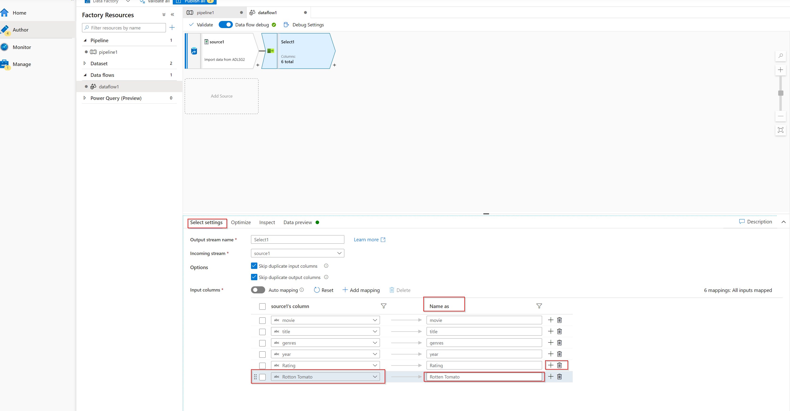

# Lab: Transforming Data with Mapping Data Flow

You are ready to build a Mapping Data Flow which will transform your data at scale via a spark cluster and then load it into a SQL database. 

## Task 1: open the Azure Data Factory

You might have closed the Azure Data Factory studio. If so, please follow this procedure to open it. If it is alread open, you can skip to task 2.

1. Sign in to the Azure portal.

1. In the left pane, select **Resource Groups**.

1. Select the **ADF** resource group.

1. In the ADF resource group, select your Azure Data Factory to open it.

1. Select the **Open Azure Data Factory Studio** link.

1. Alternatively, for the previous steps, you can open the Azure Data Factory by visiting the link https://adf.azure.com/ and signing in.

## Task 2: add a data flow activity

1. Click on the **pencil icon** on the left sidebar and select **Pipeline**, and select **pipeline1** to open the authoring canvas.

1. The **Copy data** activity you created in the previous exercise should be displayed on the canvas.

1. In the Activities pane, open the **Move and Transform** accordion and drag the **Data Flow** activity onto the pipeline canvas.

1. Connect the green rectangle from the **Copy data** activity to the **Data flow** activity. 

    

1. Turn the **Data Flow Debug** slider located at the top of the authoring module on, and click **OK** in the **Turn on data flow debug** screen that appears.  

    > NOTE: Data Flow clusters might take 5-10 minutes to warm up.

1. Select the data flow activity in the pipeline workspace. In the lower pane, select the settings tab, click **+ New** for **Data flow**.

1. Click on the grey arrow next to **Add Source**. In the dropdown, select **Add Source**.

1. In the Dataset section, click the down arrow and select the ADLS dataset you created in your Copy activity.

    

    * If your dataset is pointing at a folder with other files, you may need to create another dataset or utilize parameterization to make sure only the moviesDB.csv file is read
    * If you have not imported your schema in your ADLS, but have already ingested your data, go to the dataset's 'Schema' tab and click 'Import schema' so that your data flow knows the schema projection.

1. Once your debug cluster is warmed up, click the **Test connection** button next to the dataset. Only proceed if the connection is succesfull.

1. To verify your data is loaded correctly, click the **Data preview** tab, and click **refresh**. Once you click the refresh button, Mapping Data Flow will show a snapshot of what your data looks like when it is at each transformation.

## Task 3: Using Mapping Data Flow transformation

1. **Add a Select transformation to rename and drop a column**: In the preview of the data, you may have noticed that the "Rotton Tomato" column is misspelled. To correctly name it and drop the unused Rating column, you can add a [Select transformation](https://docs.microsoft.com/azure/data-factory/data-flow-select) by clicking on the + icon next to your ADLS source node and choosing **Select** under Schema modifier.
    
    

    In the **Name as** field, under the **Select settings** tab, change 'Rotton' to 'Rotten'. To drop the Rating column, hover over it and click on the trash can icon.

    

    * To see how the Select transformation changes your data, select the **Data preview** tab, and click **Refresh**.

2. **Add a Filter Transformation to filter out unwanted years**: Say you are only interested in movies made after 1951. You can add a [Filter transformation](https://docs.microsoft.com/azure/data-factory/data-flow-filter) to specify a filter condition by clicking on the **+ icon** next to your Select transformation and choosing **Filter** under Row Modifier. Click on the **expression box** to open up the [Expression builder](https://docs.microsoft.com/azure/data-factory/concepts-data-flow-expression-builder) and enter in your filter condition. Using the syntax of the [Mapping Data Flow expression language](https://docs.microsoft.com/azure/data-factory/data-flow-expression-functions), **toInteger(year) > 1950** will convert the string year value to an integer and filter rows if that value is above 1950.

    

    When you clicked on **open expression builder** you can verify your condition is working properly. This will also show by a check mark in the **Filter on** textbox.

    

    * To see how the Filter transformation changes your data, select the **Data preview** tab, and click **Refresh**.

3. **Add a Derive Transformation to calculate primary genre**: As you may have noticed, the genres column is a string delimited by a '|' character. If you only care about the *first* genre in each column, you can derive a new column named **PrimaryGenre** via the [Derived Column](https://docs.microsoft.com/azure/data-factory/data-flow-derived-column) transformation by clicking on the **+ icon** next to your Filter transformation and choosing **Derived Column** under Schema Modifier. Similar to the filter transformation, the derived column uses the Mapping Data Flow expression builder to specify the values of the new column.

    

    In this scenario, you are trying to extract the first genre from the genres column which is formatted as 'genre1|genre2|...|genreN'. Use the **locate** function to get the first 1-based index of the '|' in the genres string. Using the **iif** function, if this index is greater than 1, the primary genre can be calculated via the **left** function which returns all characters in a string to the left of an index. Otherwise, the PrimaryGenre value is equal to the genres field. You can verify the output via the expression builder's Data preview pane.

    - In the **Derived column's** settings tab, click **+Add** then, **Add column**, to add a column named **PrimaryGenre**. 
    - Under **Expression** open the **expression builder**. 
    - Write iif(locate('|', genres)>1,left(genres,locate('|', genres)-1),genres)
    - Select **Save and finish** to close the expression builder.

    * To see how the Derive transformation changes your data, select the **Data preview** tab, and click **Refresh**.

4. **Rank movies via a Window Transformation** Say you are interested in how a movie ranks within its year for its specific genre. You can add a [Window transformation](https://docs.microsoft.com/azure/data-factory/data-flow-window) to define window-based aggregations by clicking on the **+ icon** next to your Derived Column transformation and clicking **Window** under Schema modifier. To accomplish this, specify what you are windowing over, what you are sorting by, what the range is, and how to calculate your new window columns. In this example, we will window over PrimaryGenre and year with an unbounded range, sort by Rotten Tomato descending, and calculate a new column called RatingsRank which is equal to the rank each movie has within its specific genre-year.

    - In the **Window settings** pane under the **Over** tab, select **PrimaryGenre** and add **year** by clicking on **+** and selecting **year** from the dropdown.

    

    - In the **Sort settings** pane, select the **Rotten Tomato** column, select **Descending** under **Order** and check **Nulls first**

    

   - In the **Range by settings** pane, leave all settings per default.

    

   - In the **Window columns settings** pane, rename the blank column to **RatingsRank** and enter as expression **rank()**

    

    * To see how the Window transformation changes your data, select the **Data preview** tab, and click **Refresh**.

5. **Aggregate ratings with an Aggregate Transformation**: Now that you have gathered and derived all your required data, we can add an [Aggregate transformation](https://docs.microsoft.com/azure/data-factory/data-flow-aggregate) to calculate metrics based on a desired group by clicking on the **+ icon** next to your Window transformation and clicking **Aggregate** under Schema modifier. As you did in the window transformation, lets group movies by PrimaryGenre and year

    - Under the **Aggregate settings** tab, select **Group by**.
    - Using the dropdown select the column **Primary Genre** and add the **year** column by clicking **+**, and dropdown.
    
    

    In the Aggregates tab, you can calculate aggregations over the specified group-by columns. For every genre and year, lets get the average Rotten Tomatoes rating, the highest and lowest rated movie (utilizing the windowing function) and the number of movies that are in each group. Aggregation significantly reduces the amount of rows in your transformation stream and only propagates the group by and aggregate columns specified in the transformation.

    - Under the **Aggregate settings** tab, now select **Aggregates**. Add the following columns by clicking **+** and then **Add column**, with their respective expressions:
        - AverageRating: avg(toInteger({Rotten Tomato}))
        - HighestRead: first(title)
        - LowestRead: last(title)
        - NumberOfMovies: count()

    

    * To see how the aggregate transformation changes your data, select the **Data preview** tab, and click **Refresh**.

6. **Specify Upsert condition via an Alter Row Transformation** If you are writing to a tabular sink, you can specify insert, delete, update and upsert policies on rows using the [Alter Row transformation](https://docs.microsoft.com/azure/data-factory/data-flow-alter-row) by clicking on the **+ icon** next to your Aggregate transformation and clicking **Alter Row** under Row modifier. Since you are always inserting and updating, you can specify that all rows will always be upserted.

    - From the dropdown next to **Alter row conditions** in the **Alter row settings** tab, please select **Upsert if**. In the expression write **true()**

    

    * To see how the Alter Row transformation changes your data, select the **Data preview** tab, and click **Refresh**.

### Task 4: Writing to a SQL Database Sink

1. **Write to a sink**: Now that you have finished all your transformation logic, you are ready to write to a Sink.

    1. Add a sink by clicking on the **+ icon** next to your Alter row transformation and clicking **Sink** under Destination.

    2. In the Sink tab, create a dataset via the **+ New button** next to **Dataset**.

    3. Select **Azure SQL Database** from the tile list and click **Continue**

    4. In Set Properties blade, click on the **Linked Service** dropdown. Select **New**.

    5. In the New linked service blade, select your only server from the **Server name** drop down.

    6. In the **Database name** drop down, select **AdventureWorksLT**.

    7. Set the **Authentication type** to **SQL Authentication**. 

    8. Fill in your firstname as the **User name** and set the password to **Pa55w.rd**.
    
    9. Click the **Test connection** button in the lower right corner of the screen. If the test is succesfull, click on **Create**.

    10. Once you have configured your linked service, you enter the set properties blade. Select **Create new table**.

    11. Click **OK** once completed.

At this point, You have finished building your 8 transformation Mapping Data Flow. It's time to run the pipeline and see the results!

## Task 5: Running the Pipeline, and verify output

1. Go to the pipeline1 tab in the canvas. 

1. Run another debug run to confirm it's working as expected. Looking at the **Output** tab, you can monitor the status of both activities as they are running.

1. Once both activities succeeded, you can click on the eyeglasses icon next to the Data Flow activity to get a more in depth look at the Data Flow run. If you used the same logic described in this lab, your Data Flow should have written 737 rows to your sink.

1. To verify the output return to the **Azure portal** tab in the web browser.

1. Open the **storxxxxx** storage account from the **ADF** resource group and select **containers**. 

1. Select the **data** container and inspect the csv file.
