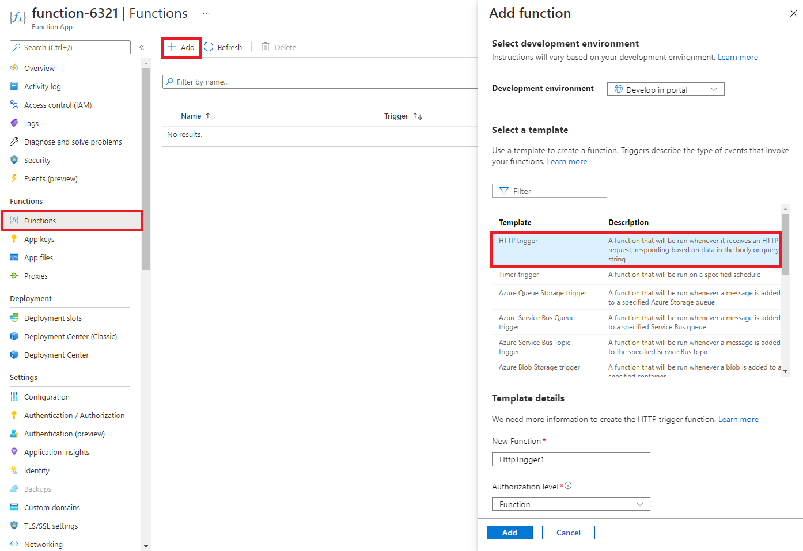

# Lab: Use Azure Functions in Azure Data Factory

In this lab, we will create a Function App to display a Hello message when there is an HTTP request. We will call this function from the data factory.


## Task 1: Create a Function app 

In this task, we will create a Function app.

1. Browse to the Azure portal at [**http://portal.azure.com**](http://portal.azure.com) and sign in.

1. In the Azure portal, at the top left of the screen, click on the **+ Create a resource** icon.

1. In the New screen, click **Function app** in the list that appears.

1. On the **Basics** tab of the **Function App** blade, specify the following settings: 

    | Settings | Value |
    | -- | --|
    | Subscription | **Keep default supplied** |
    | Resource group | **ADF** |
    | Function App name | **funxxxxx** |  (replace **xxxxx** with digits such that the name is globally unique)
    | Publish | **Code** |
    | Runtime stack | **.NET** |
    | Version | **3.1** |
    | Region | **West Europe** |

    **Note** - Remember to change the **xxxxx** so that it makes a unique **Function App name**

1. Inspect the contents of the **Hosting** tab. Notice the **Plan type** is set to **Consumption**.

4. Click **Review + Create** and, after successful validation, click **Create** to begin provisioning and deploying your new Azure Function App.

5. Wait for the notification that the resource has been created. This might take a minute.

6. When the deployment has completed, click **Go to resource** from the deployment blade. 


## Task 2: Create a HTTP triggered function and test

In this task, we will use the Webhook + API function to display a message when there is an HTTP request. 

1. On the function app blade, in the **Functions** section, click **Functions** and then click **+ Create**.

    

2. An **Add function** pop-up window will appear on the right. In the **Select a template** section click **HTTP trigger**. Click **Create**.

    

3. On the **HttpTrigger1** blade, in the **Developer** section, click **Code + Test**. 

4. On the **Code + Test** blade, review the auto-generated code and note that the code is designed to run an HTTP request and log information. Also, notice the function returns a Hello message with a name. 

    

5. Click **Get function URL** from the top section of function editor. 

6. Ensure that the value in the **Key** drop-down list is set to **default** and click **Copy** to copy the function URL. 

    

7. Open a new browser tab and paste the copied function URL into your web browser's address bar. When the page is requested the function will run. Notice the returned message stating that the function requires a name in the request body.

    

8. Append **&name=*yourname*** to the end of the URL.

    **Note**: For example, if your name is Cindy, the final URL will resemble the following:

    `https://funxxxxx.azurewebsites.net/api/HttpTrigger1?code=X9xx9999xXXXXX9x9xxxXX==&name=cindy`

    

9. Please notice the name of the function in the URL, behind API and before the first question mark. In this case it is **HttpTrigger1**. This is the name of your function. Make sure you can identify the function name as part of the URL.

10. When you hit enter, your function runs and every invocation is traced. To view the traces, return to the Portal **HttpTrigger1 \| Code + Test** blade and click **Monitor**. You can **configure** Application Insights by selecting the timestamp and click **Run query in Application Insights**.

     

11. Return to the Azure portal, and select the **Function Keys** section. Click **Show values** and click **Copy to clipboard**.

    

Congratulations! You have created a Function App to display a Hello message when there is an HTTP request.  


## Task 3: call the Azure function from Azure Data Factory

1. Return to the Azure portal and open the **ADF** resource group.

1. In the ADF resource group, select your Azure Data Factory to open it.

1. Select the **Open Azure Data Factory Studio** link.

1. Alternatively, for the previous steps, you can open the Azure Data Factory by visiting the link https://adf.azure.com/ and signing in.

1. Click on the **pencil icon** on the left sidebar and select the **+** button, select **pipeline**, and select **pipeline** to open the authoring canvas.

    

1. In the Activities pane, open the **Azure Function** section and drag the **Azure Function** activity onto the pipeline canvas.

1. In the **Settings** tab, Select **+ New** next to **Azure Function Linked Service**.

1. This opens a new window. Select your Azure Function from the **Azure Function App url** drop down list.

1. Paste the function app key, which should still be in your clipboard, into the **Function Key** section.

1. Click **Create**.

1. Back in the **Settings** tab of the Azure Function, type the name of the function in the specified field. For example: **HttpTrigger1**.

1. Set the **Method** to **POST**.

1. Type this text into the Body section: **{"name":"Dimitri"}**.

1. Click on the **Debug** button at the top of the pipeline canvas. This will start a pipeline debug run.

1. To monitor the progress of a pipeline debug run, click on the **Output** tab of the pipeline

1. Verify that the function runs successfully. Inspect the **Input** and **Output** icons in the Debug run output.


## Task 4: implement system parameters in an activity

1. Return to the **Settings** tab of the Azure Function.

1. Clear the **Body** section, hover over the **Body** field, and click **Add dynamic content**.

1.  replace it with this:
```
{ 
  "name": "@{pipeline().Pipeline}"
}
```

1. Click on the **Debug** button at the top of the pipeline canvas. This will start a pipeline debug run.

1. To monitor the progress of a pipeline debug run, click on the **Output** tab of the pipeline

1. Verify that the function runs successfully. Inspect the **Input** and **Output** icons in the Debug run output.


## Task 5: implement user defined parameters in an activity

1. Click anywhere on a blank section in the canvas. This displays the pipeline properties.

    

1. Select the **Parameters** tab. Click **+ New** to create a new parameter.

1. In the **Name** field, fill out **name** (which is the only accepted parameter for our Azure Function).

1. In the **Default value** field, fill out your own name.

1. Select to **Azure Function** activity you created earlier, and return to the **Settings** tab of the Azure Function.

1. Clear the **Body** section, hover over the **Body** field, and click **Add dynamic content**.

1.  replace it with this:
``` 
{ 
  "name": "@{pipeline().parameters.name}"
}
```

1. Click on the **Debug** button at the top of the pipeline canvas. This will start a pipeline debug run.

1. To monitor the progress of a pipeline debug run, click on the **Output** tab of the pipeline

1. Verify that the function runs successfully. Inspect the **Input** and **Output** icons in the Debug run output.


## Task 6: invoke a pipeline run with PowerShell

Choose if you want to perform this task from the VM, which takes up some extra time to install the required dependencies, or to perform this task from the Cloud Shell.

### Skip this section if you want to perform this task from the cloud shell.

1. From the Azure portal, open the **Virtual Machines** section.

1. Make sure your SQL VM is started.

1. On the **Overview** page for the virtual machine, select the **Connect** button and choose **RDP**. 

1. Log on to your VM with your specified credentials. 

1. Start **Windows PowerShell** from the Start Menu.

1. Run this command to install the required dependencies:
    ```powershell
    Install-Module Az
    Connect-AzAccount
    ```

1. Skip the next section to continue with the Data Factory invocation.


### Skip this section if you performed the previous section.

1. From the Azure portal, open the **Azure Cloud Shell** by clicking on the icon in the top right of the Azure Portal.

    

1. When prompted to select either **Bash** or **PowerShell**, select **PowerShell**.

1. On the **You have no storage mounted** screen select **Show advanced settings** then fill in the information below

    | Settings | Values |
    |  -- | -- |
    | Resource Group | **ADF** |
    | Storage account (Create a new account) | **cloudshellxxxxxxx** |
    | File share (create new) | **cloudshare** |

1. Select **Create Storage**

1. Wait for the Cloud Shell to initialize. 


### Continue with this section in all cases

1. Enter the following commands in the shell, one line at a time, and observe the output.

```powershell
$ResourceGroupName = 'ADF'
$PipelineName = 'pipeline2'
$factory = Get-AzDataFactoryV2 -ResourceGroupName $ResourceGroupName

$id = Invoke-AzDataFactoryV2Pipeline -ResourceGroupName $ResourceGroupName -DataFactoryName $factory.DataFactoryName -PipelineName $PipelineName -parameter @{name='Dimitri'}

Get-AzDataFactoryV2PipelineRun -PipelineRunId $id -ResourceGroupName $ResourceGroupName -DataFactoryName $factory.DataFactoryName

Get-AzDataFactoryV2ActivityRun -PipelineRunId $id -ResourceGroupName $ResourceGroupName -DataFactoryName $factory.DataFactoryName -RunStartedAfter '2022-01-01' -RunStartedBefore '2030-01-01'
```

1. If all has gone well, you have successfully invoked a pipeline run from PowerShell, and inspected the results with the final two commands.
