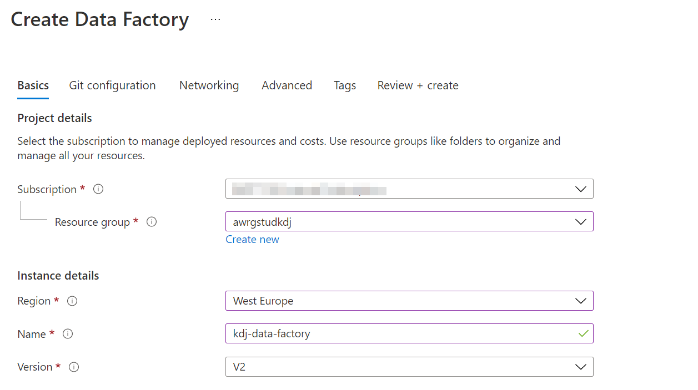
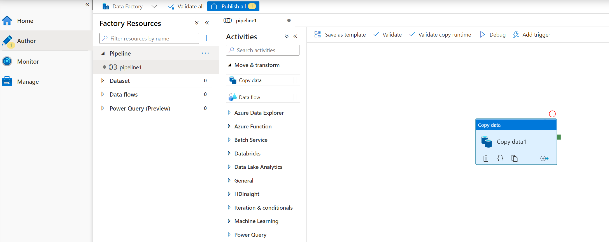
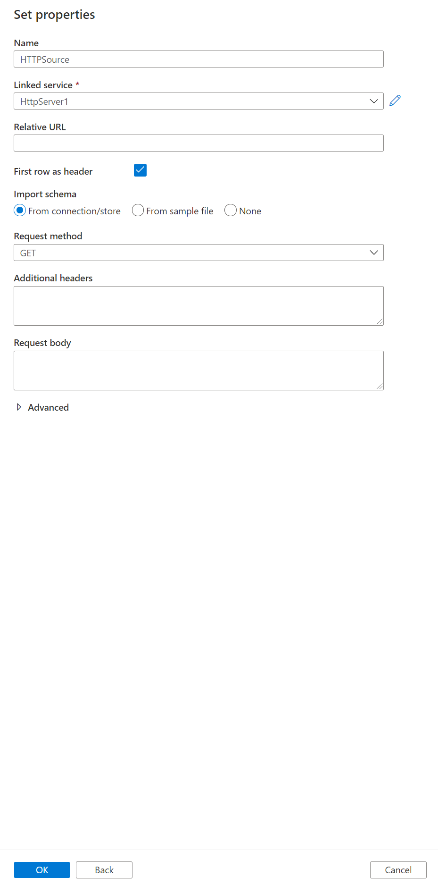
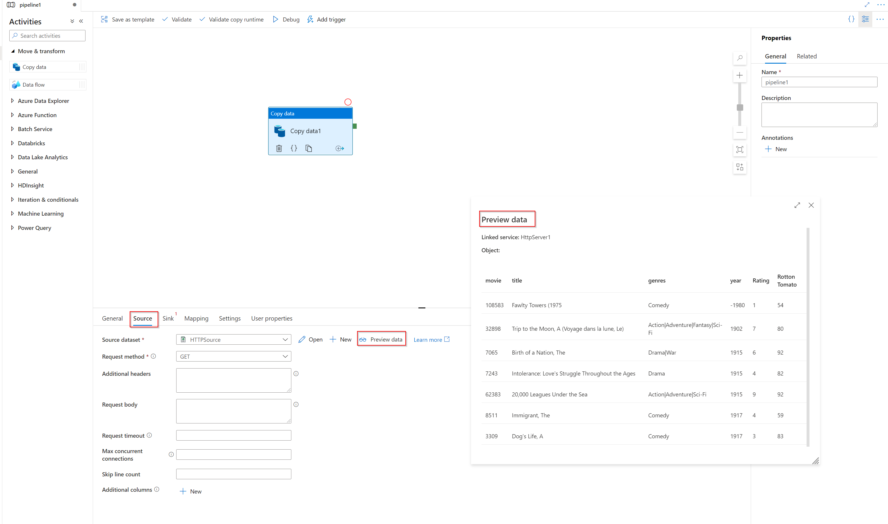
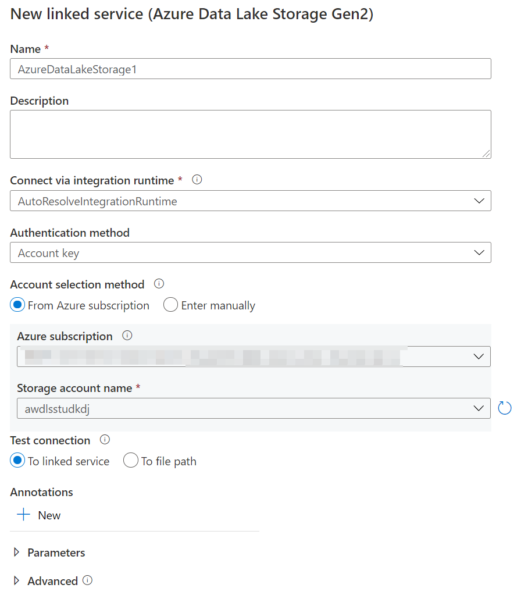
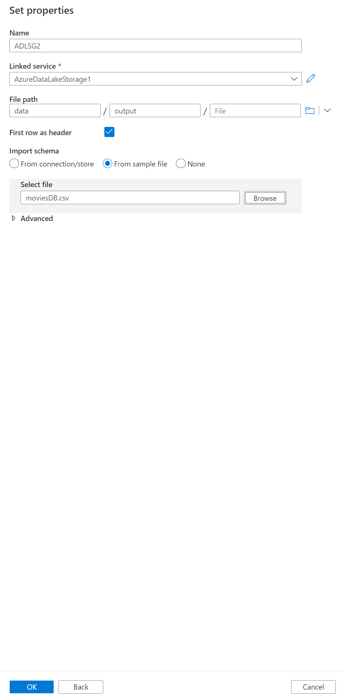
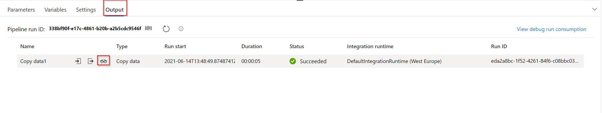

# DP 200 Lab 7 - Orchestrating Data Movement with Azure Data Factory

**Estimated Time**: 30 minutes

**Pre-requisites**: It is assumed that the case study for this lab has already been read. It is assumed that the content and lab for module 1: Azure for the Data Engineer has also been completed

* **Azure subscription**: If you don't have an Azure subscription, create
    a [free account](https://azure.microsoft.com/free/) before you begin.

* **Azure Data Lake Storage Gen2 storage account**: If you don't have an ADLS
    Gen2 storage account, see the instructions in [Create an ADLS Gen2 storage
    account](https://docs.microsoft.com/en-us/azure/storage/blobs/data-lake-storage-quickstart-create-account).

* **Azure Synapse Analytics**: If you don't have a Azure Synapse Analytics account, see the instructions in [Create a SQL DW
    account](https://docs.microsoft.com/en-us/azure/sql-data-warehouse/create-data-warehouse-portal).

## Lab overview

In this module, students will learn how Azure Data factory can be used to orchestrate the data movement from a wide range of data platform technologies. They will be able to explain the capabilities of the technology and be able to set up an end to end data pipeline that ingests data from SQL Database and load the data into Azure Synapse Analytics.

## Lab objectives
  
After completing this lab, you will be able to:

1. Setup Azure Data Factory
1. Ingest data using the Copy Activity
1. Use the Mapping Data Flow task to perform transformation

## Scenario
  
You are assessing the tooling that can help with the extraction, load and transforming of data into the data warehouse, and have asked a Data Engineer within your team to show a proof of concept of Azure Data Factory to explore the transformation capabilities of the product. The proof of concept does not have to be related to AdventureWorks data, and you have given them freedom to pick a dataset of thier choice to showcase the capabilities.

At the end of this lad, you will have:

1. Setup Azure Data Factory
1. Ingested data using the Copy Activity
1. Used the Mapping Data Flow task to perform transformation

## Exercise 1: Setup Azure Data Factory

Estimated Time: 15 minutes

Individual exercise

The main task for this exercise are as follows:

1. Setup Azure Data Factory

### Task 1: Setting up Azure Data Factory.

Create your data factory: Use the [Azure Portal](https://portal.azure.com) to create your Data Factory. 

1. In Microsoft Edge, go to the Azure portal tab, click on the **+ Create a resource** icon, type **factory**, and then click **Data Factory** from the resulting search, and then click **Create**.

1. In the New Data Factory screen, create a new Data Factory with the following options, then click **Create**:
    - **Name**: xx-data-factory, where xx are your initials
    - **Version**: V2
    - **Subscription**: Your subscription
    - **Resource group**: awrgstudxx
    - **Location**: select the location closest to you
    - **Enable GIT**: unchecked
    - Leave other options to their default settings

        

    > **Note**: The creation of the Data Factory takes approximately 1 minute.

> **Result**: After you completed this exercise, you have created an instance of Azure Data Factory

## Exercise 2: Ingest data using the Copy Activity
  
Estimated Time: 15 minutes

Individual exercise
  
The main tasks for this exercise are as follows:

1. Add the Copy Activity to the designer

1. Create a new HTTP dataset to use as a source

1. Create a new ADLS Gen2 sink

1. Test the Copy Activity

### Task 1: Add the Copy Activity to the designer

1. On the deployment successful message, click on the button **Go to resource**.

1. In the xx-data-factory screen, in the middle of the screen, click on the button, **Author & Monitor**

1. If coming from the ADF homepage, click on the **pencil icon** on the left sidebar or the **create pipeline button** to open the authoring canvas.

1. Click on the **+** button in the **Factory Resources** pane and select **Pipeline**

1. In the Activities pane, open the **Move and Transform** accordion and drag the **Copy Data** activity onto the pipeline canvas.

    

### Task 2: Create a new HTTP dataset to use as a source

1. In the Source tab of the Copy activity settings, click **+ New**

1. In the data store list, select the **HTTP** tile and click continue

1. In the file format list, select the **DelimitedText** format tile and click continue

1. In Set Properties blade, give your dataset an understandable name such as **HTTPSource** and click on the **Linked Service** dropdown. If you have not created your HTTP Linked Service, select **New**.

1. In the New Linked Service (HTTP) screen, specify the url of the moviesDB csv file. You can access the data with no authentication required using the following endpoint:

    https://raw.githubusercontent.com/djpmsft/adf-ready-demo/master/moviesDB.csv

1. Place this in the **Base URL** text box. 

1. In the **Authentication type** drop down, select **Anonymous**. and click on **Create**.

    -  Once you have created and selected the linked service, specify the rest of your dataset settings. These settings specify how and where in your connection we want to pull the data. As the url is pointed at the file already, no relative endpoint is required. As the data has a header in the first row, set **First row as header** to be true and select Import schema from **connection/store** to pull the schema from the file itself. Select **Get** as the request method. You will see the followinf screen

        
           
    - Click **OK** once completed.
   
    a. To verify your dataset is configured correctly, click **Preview Data** in the Source tab of the copy activity to get a small snapshot of your data.
   
   

### Task 3: Create a new ADLS Gen2 dataset sink

1. Click on the **Sink tab**, and the click **+ New**

1. Select the **Azure Data Lake Storage Gen2** tile and click **Continue**.

1. Select the **DelimitedText** format tile and click **Continue**.

1. In Set Properties blade, give your dataset an understandable name such as **ADLSG2** and click on the **Linked Service** dropdown. If you have not created your ADLS Linked Service, select **New**.

1. In the New linked service (Azure Data Lake Storage Gen2) blade, select your authentication method as **Account key**, select your **Azure Subscription** and select your Storage account name of **awdlsstudxx**. You will see a screen as follows:

   

1. Click on **Create**

1. Once you have configured your linked service, you enter the set properties blade. As you are writing to this dataset, you want to point the folder where you want moviesDB.csv copied to.
1. Set the file system to **data** and the folder to **output**.
1. Set **First row as header** to be true.

   

1. Click **OK** once completed.

### Task 4: Test the Copy Activity

At this point, you have fully configured your copy activity. To test it out, click on the **Debug** button at the top of the pipeline canvas. This will start a pipeline debug run.

1. To monitor the progress of a pipeline debug run, click on the **Output** tab of the pipeline

1. To view a more detailed description of the activity output, click on the eyeglasses icon. This will open up the copy monitoring screen which provides useful metrics such as Data read/written, throughput and in-depth duration statistics.

   

1. To verify the copy worked as expected, open up your ADLS gen2 storage account and check to see your file was written as expected.
