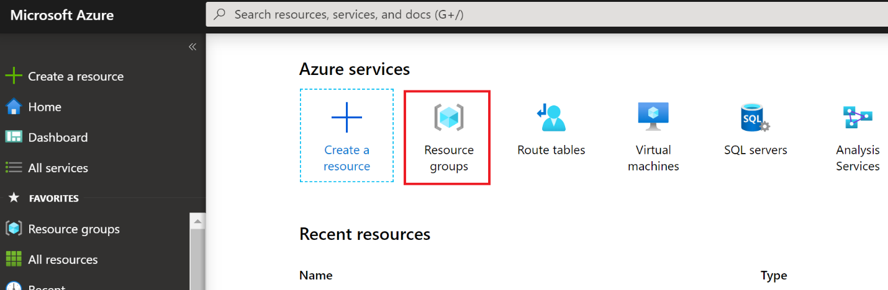
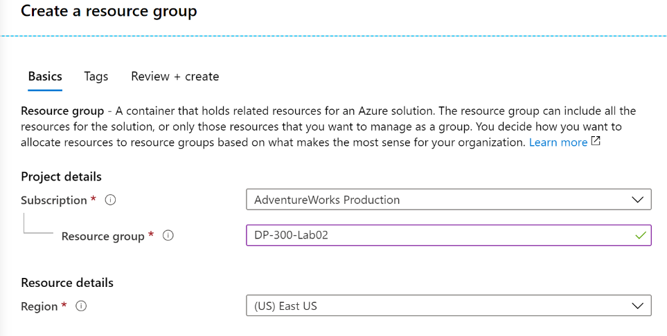

## Task 1: Create a Resource Group

1. Start a browser, and open the Azure Portal at [https://portal.azure.com](https://portal.azure.com/), logging in with the appropriate credentials

2. From the Home screen, click on the **Resource Groups** button  

	

3. Review your existing Resource Groups and then click on the **Create** button to create a new Resource Group.  

	

4. Complete the Create a Resource Group wizard with the required information to create the RG.

	- Ensure Subscription is set to the desired subscription

	- Enter **DP-300-Lab02** for the name of the Resource Group

	- For the purposes of this lab, select the Region nearest to your physical location

	- Click the **Review + create** button  

	

	- Click the **Create** button

